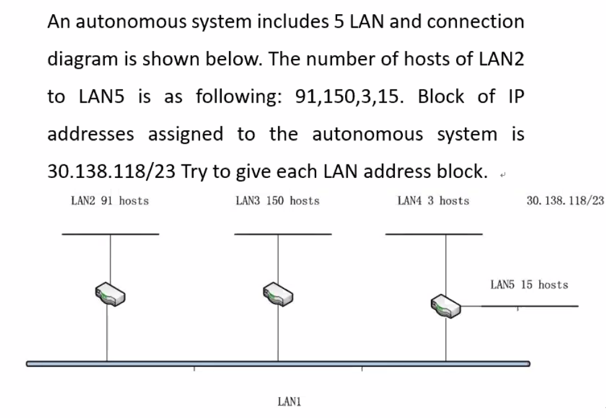

Exam1-考试题型分析
---

<!-- TOC -->

- [1. 题型](#1-题型)
- [2. 例题](#2-例题)
  - [2.1. 过程](#21-过程)
  - [2.2. 答案](#22-答案)
- [3. 关于VLSM+CIDR用来划分子网的计算](#3-关于vlsmcidr用来划分子网的计算)

<!-- /TOC -->

# 1. 题型
1. 单选 15个 1分
2. 多选 8个  2分(2个及以上)，全对2分，正确选项的非空子集，1分
3. 名词 8个  3分 一般是英语的缩写，
   1. 1分是英语全称 CSMA/CD
   2. 1分是中文全称，稍微偏差
   3. 解释描述，内涵或者外延，不要有错误
4. 大题 6-7个
   1. 问答题
   2. 计算题(考点不多)
5. 范围:从第1讲到第11讲PPT内容，补充内容不考
6. PPT上出现的网络指令有要求

# 2. 例题


1. 求网络号和子网掩码号,全0可以使用
2. LAN1 如果没有地址是不行的
3. 从低地址开始分配，答案不唯一，先取0

## 2.1. 过程
1. 一共9位可用，必然是全0可用，如果不可用则配置150的，一般会写全0可用，如果题目没写就是不可用，除非不用不行
2. 说91个地址，包含了路由器的地址
```
000 000 000
LAN3最大 先分配/24的网:30.138.118.0/24
100 000 000
LAN2 /25的网:30.138.119.0/25
110 000 000
LAN5 /27的网 30.138.119.128/27
110 100 000
偷懒版LAN1和4的做法:
111 000 000
111 100 000
LAN4、LAN1 /29的网(正常):
110 100 000 30.138.119.160/29
110 101 000 30.138.119.168/29
```

## 2.2. 答案
1. lan1 3个路由器，至少是/29的网络
2. lan2 30.138.119.0/25
3. lan3 30.138.118.0/24
4. lan4 30.138.119.144/30
5. lan5 30.138.119.128/28

# 3. 关于VLSM+CIDR用来划分子网的计算
- 例：13年试卷A第6题，将192.168.20.0/24划分四个区域的子网，区域A有60台主机，区域B有6台主机，区域C有12台主机，区域D有31台主机
  - **解答：192开头，所以该IP为一个C类地址，最后8位可分割**
  - **对于区域A，需要6位做主机号，所以子网掩码为255.255.255.192 网段为192.168.20.0/26**
  - **对于区域D，需要5位做主机号，后8位为01000000，所以子网掩码为255.255.255.224 ，网段为192.168.20.64/27**
  - **对于区域C，需要4位做主机号，后8位为01100000 所以子网掩码为255.255.255.240， 网段为192.168.20.96/28**
  - **对于区域B，需要3位做主机号，后8位为01110000 所以子网掩码为255.255.255.248 网段为192.168.20.112/29**
