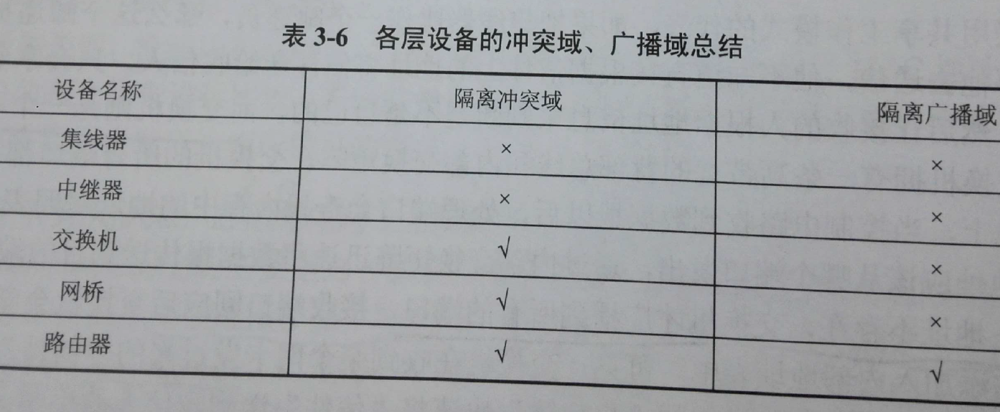

exam03-部分简答题
---

# 1. 路由器和交换机的区别
1. 路由器是互联网的主要节点设备。路由器通过路由决定数据的转发。转发策略称为路由选择（routing），这也是路由器名称的由来（router）。作为不同网络之间互相连接的枢纽，路由器系统构成了基于TCP/IP的国际互连网络Internet的主体脉络，也可以说，路由器构成了Internet的骨架。它的处理速度是网络通信的主要瓶颈之一，它的可靠性则直接影响着网络互连的质量。
2. 交换机则是一种基于MAC地址识别，能完成封装转发数据包功能的网络设备。交换机可以“学习”MAC地 址，并把其存放在内部地址表中，通过在数据帧的始发者和目标接收者之间建立临时的交换路径，使数据帧直接由源地址到达目的地址。
3. 路由器和交换机的区别主要分为如下四部分：
   1. 二者的工作层次不同：最初的的交换机是工作在OSI／RM开放体系结构的数据链路层，也就是第二层，而路由器一开始就设计工作在OSI模型的网络层。由于交换机工作在OSI的第二层（数据链路层），所以它的工作原理比较简单，而路由器工作在OSI的第三层（网络层），可以得到更多的协议信息，路由器可以做出更加智能的转发决策。
   2. 二者的据转发所依据的对象不同：交换机是利用物理地址或者说MAC地址来确定转发数据的目的地址。而路由器则是利用不同网络的ID号（即IP地址）来确定数据转发的地址。IP地址是在软件中实现的，MAC地址通常是硬件自带的.
   3. 传统的交换机只能分割冲突域，不能分割广播域；而路由器可以分割广播域由交换机连接的网段仍属于同一个广播域，广播数据包会在交换机连接的所有网段上传播，在某些情况下会导致通信拥挤和安全漏洞。连接到路由器上的网段会被分配成不同的广播域，广播数据不会穿过路由器。虽然第三层以上交换机具有VLAN功能，也可以分割广播域，但是各子广播域之间是不能通信交流的，它们之间的交流仍然需要路由器。 
   4. 路由器提供了防火墙的服务，而交换机则没有：综上所述，交换机一般用于LAN-WAN的连接，交换机归于网桥，是数据链路层的设备，有些交换机也可实现第三层的交换。路由器用于WAN-WAN之间的连接，可以解决异性网络之间转发分组，作用于网络层。他 们只是从一条线路上接受输入分组，然后向另一条线路转发。这两条线路可能分属于不同的网络，并采用不同协议。相比较而言，路由器的功能较交换机要强大，但速度相对也慢，价格昂贵，第三层交换机既有交换机线速转发报文能力，又有路由器良好的控制功能，因此得以广泛应用。 

# 2. 子网掩码的作用
子网掩码(subnet mask)又叫网络掩码、地址掩码、子网络遮罩，它是一种用来指明一个IP地址的哪些位标识的是主机所在的子网以及哪些位标识的是主机的位掩码。子网掩码不能单独存在，它必须结合IP地址一起使用。子网掩码只有一个作用，就是将某个IP地址划分成网络地址和主机地址两部分。通过IP 地址的二进制与子网掩码的二进制进行与运算，确定某个设备的网络地址和主机号，也就是说通过子网掩码分辨一个网络的网络部分和主机部分。子网掩码一旦设置，网络地址和主机地址就固定了。子网一个最显著的特征就是具有子网掩码。与IP地址相同，子网掩码的长度也是32位，也可以使用十进制的形式。例如，为二进制形式的子网掩码：11111111.11111111.11111111.00000000，采用十进制的形式为：255.255.255.0。

# 3. TCP保证通信的可靠性的方式
1. 应用数据被分割成TCP认为最适合发送的数据块。这和UDP完全不同，应用程序产生的数据报长度将保持不变。由TCP传递给IP的信息单位称为报文段或段（segment）TCP如何确定报文段的长度。
2. 当TCP发出一个段后，它启动一个定时器，等待目的端确认收到这个报文段。如果不能及时收到一个确认，将重发这个报文段。当TCP收到发自TCP连接另一端的数据，它将发送一个确认。这个确认不是立即发送，通常将推迟几分之一秒。
3. TCP将保持它首部和数据的检验和。这是一个端到端的检验和，目的是检测数据在传输过程中的任何变化。如果收到段的检验和有差错，TCP将丢弃这个报文段和不确认收到此报文段（希望发端超时并重发）。
4. 既然TCP报文段作为IP数据报来传输，而IP数据报的到达可能会失序，因此TCP报文段的到达也可能会失序。如果必要，TCP将对收到的数据进行重新排序，将收到的数据以正确的顺序交给应用层。
5. 既然IP数据报会发生重复，TCP的接收端必须丢弃重复的数据。
6. TCP还能提供流量控制。TCP连接的每一方都有固定大小的缓冲空间。TCP的接收端只允许另一端发送接收端缓冲区所能接纳的数据。这将防止较快主机致使较慢主机的缓冲区溢出。

# 4. 为什么要使用数据包？
1. 计算机可以轮流发送数据包，分时段处理不同报文，使得多进程处理事务。
2. 如果数据包丢失，则只需重新传输少量数据。TCP/IP下，我们分组传输，防止链路故障带来的问题。过大数据段会影响我们的重传、
3. 数据可以采用不同的路径，每个数据包可以单独传输。

# 5. 使用分层模型的原因？
1. 降低复杂度，使用分解法来进行操作。
2. 标准化接口，每层和每层之间标准化处理
3. 促进模块化工程，保证各层之间可以相对独立的进行发展
4. 确保内部可操作的技术，可以用不同网络程序，但是都用一样的低层。
5. 促进发展，各层的公司只要关注本层的即可
6. 简化教学与学习，简化教学和学习

# 6. 网络层设备
