lecture01-Computer Network & Network Reference Model(计算机网络及其参考模型)
---

<!-- TOC -->

- [1. Overview of Computer Network 计算机网络概述](#1-overview-of-computer-network-计算机网络概述)
  - [1.1. 计算机网络 network](#11-计算机网络-network)
  - [1.2. 数据网络分类](#12-数据网络分类)
    - [1.2.1. 局域网和广域网的差别](#121-局域网和广域网的差别)
    - [1.2.2. 局域网设备](#122-局域网设备)
    - [1.2.3. 广域网设备](#123-广域网设备)
    - [1.2.4. 局域网设备和广域网设备](#124-局域网设备和广域网设备)
  - [1.3. Internet 互联网](#13-internet-互联网)
    - [1.3.1. 多层ISP结构的Internet](#131-多层isp结构的internet)
- [2. 计算机网络基本概念](#2-计算机网络基本概念)
  - [2.1. 数据](#21-数据)
    - [2.1.1. 数据报](#211-数据报)
  - [2.2. 协议](#22-协议)
  - [2.3. 源地址和目标地址](#23-源地址和目标地址)
  - [2.4. 传输介质](#24-传输介质)
  - [2.5. 数据带宽(BandWith)](#25-数据带宽bandwith)
  - [2.6. 通量(Thoughput)](#26-通量thoughput)
- [3. OSI Reference Model (Open System Interconnection 参考模型)](#3-osi-reference-model-open-system-interconnection-参考模型)
  - [3.1. 层次模型](#31-层次模型)
  - [3.2. 为什么设计层次模型?](#32-为什么设计层次模型)
  - [3.3. 4+3模型](#33-43模型)
  - [3.4. 各层次介绍](#34-各层次介绍)
    - [3.4.1. Layer 1:The Physical Layer 物理层](#341-layer-1the-physical-layer-物理层)
    - [3.4.2. Layer 2:The Data Link Layer 数据链路层](#342-layer-2the-data-link-layer-数据链路层)
    - [3.4.3. Layer 3:The NetWork 网络层](#343-layer-3the-network-网络层)
    - [3.4.4. Layer 4:The Transport Layer 运输层](#344-layer-4the-transport-layer-运输层)
    - [3.4.5. The Layer 5:The Session Layer 会话层](#345-the-layer-5the-session-layer-会话层)
    - [3.4.6. The Layer 6:The Presentation Layer 表示层](#346-the-layer-6the-presentation-layer-表示层)
    - [3.4.7. Layer 7: The Application Layer 应用层](#347-layer-7-the-application-layer-应用层)
  - [3.5. Protocols on ISO layers ISO模型下对应的协议内容](#35-protocols-on-iso-layers-iso模型下对应的协议内容)
  - [3.6. Data Encapsulation 数据封装](#36-data-encapsulation-数据封装)
  - [3.7. Peer-to-Peer Communications 点对点通信](#37-peer-to-peer-communications-点对点通信)
- [4. TCP/IP Model](#4-tcpip-model)
  - [4.1. 四层模型 TCP/IP Model](#41-四层模型-tcpip-model)
    - [4.1.1. 第四层：Application Layer 应用层](#411-第四层application-layer-应用层)
    - [4.1.2. 第三层：Transport Layer 传输层](#412-第三层transport-layer-传输层)
    - [4.1.3. 第二层：Internet Layer 互联网层](#413-第二层internet-layer-互联网层)
    - [4.1.4. 第一层：Network Access Layer 网络接入层](#414-第一层network-access-layer-网络接入层)
  - [4.2. 常见的TCP/IP协议](#42-常见的tcpip协议)
  - [4.3. TCP/IP 模型 和 OSI 模型的相似点](#43-tcpip-模型-和-osi-模型的相似点)
  - [4.4. TCP/IP 模型 和 OSI 模型的不同点](#44-tcpip-模型-和-osi-模型的不同点)
- [5. 网络拓扑](#5-网络拓扑)
  - [5.1. Bus 总线型拓扑](#51-bus-总线型拓扑)
  - [5.2. Ring 环形拓扑](#52-ring-环形拓扑)
  - [5.3. Dual Ring 双环拓扑](#53-dual-ring-双环拓扑)
  - [5.4. Star 星型拓扑](#54-star-星型拓扑)
  - [5.5. Tree 树形拓扑结构](#55-tree-树形拓扑结构)
  - [5.6. Complete(Mesh) 渔网型拓扑](#56-completemesh-渔网型拓扑)
  - [5.7. Cellular 蜂窝型拓扑](#57-cellular-蜂窝型拓扑)
- [6. Network Devices 网络设备](#6-network-devices-网络设备)
  - [6.1. 拓扑的局域网设备](#61-拓扑的局域网设备)
  - [6.2. NICs - Layer2 网卡 Network Interface Controller(网络终端设备)](#62-nics---layer2-网卡-network-interface-controller网络终端设备)
  - [6.3. Media – Layer 1 介质 网络中间设备](#63-media--layer-1-介质-网络中间设备)
  - [6.4. Repeaters – Layer 1 中继器 网络中间设备](#64-repeaters--layer-1-中继器-网络中间设备)
  - [6.5. Hubs - Layer 1 集线器 网络中间设备](#65-hubs---layer-1-集线器-网络中间设备)
    - [6.5.1. 中继器和集线器的不同](#651-中继器和集线器的不同)
  - [6.6. Bridges – Layer 2 网桥 网络中间设备](#66-bridges--layer-2-网桥-网络中间设备)
  - [6.7. Switches – Layer 2 交换机 网络中间设备](#67-switches--layer-2-交换机-网络中间设备)
  - [6.8. Routers – Layer 3 路由器 网络中间设备](#68-routers--layer-3-路由器-网络中间设备)
  - [6.9. 网络设备和OSI层次模型演变(Evolution)](#69-网络设备和osi层次模型演变evolution)

<!-- /TOC -->

# 1. Overview of Computer Network 计算机网络概述

## 1.1. 计算机网络 network
1. 什么是网络？网络是由物体、设备或人组成的错综复杂(intricately)的连接系统
2. 计算机网络:是网络的一种
    + 目的:共享资源，资源类型比较广泛。
    + 传送的类型是**二进制**数据流。
3. 企业也可以构成网络:随着公司的扩张，连接不同站点的网络的需求变得非常重要
4. 计算机网络**标准和规范**组成当前计算机网络的形式。

## 1.2. 数据网络分类
1. LAN( Local Area Networks ) 局域网:广播方式通信
2. WAN( Wide Area Networks ) 广域网
    + 先于LAN网络产生
    + 点对点通信
3. 网络抽象模型
    + node:结点
    + link:链路

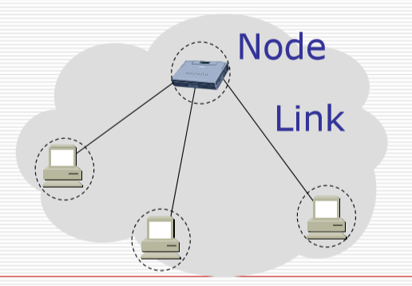

### 1.2.1. 局域网和广域网的差别
1. 局域网，LAN，Local Area Networks
    + 作用范围比较窄
    + 多用户同时复用链路介质
    + 网络性能比较高(一般是一个公司来管理处理，可以达到GPS甚至是10GPS)
    + 出错率相对比较容易控制(低)
2. 广域网，WAN，Wide Area Networks
    + 在比较大的地理范围上进行连接 
    + 要么串行连接(serial links)，要么光链路连接(optical links)
    + 传统上，传输速率比较低，因为一般是多公司管理，标准和介质等都不同 
    + 出错率相对比较高

### 1.2.2. 局域网设备
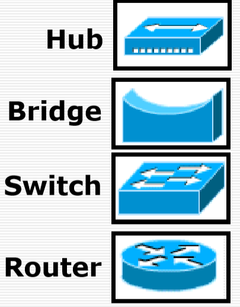

1. Hub 集线器:工作在第一层
    + 多端口中继器(Reapter)，连接PC
    + 重复信号
2. Bridge 网桥:工作在第二层
    + 将局域网分段
    + 局域网分段
    + 进行MAC地址的计算
3. Switch 交换机，多端口网桥:工作在第二层
    + 多端口网桥
    + 全带宽
    + 大规模集成电路实现:相对于网桥的优点
4. Router 路由器:工作在第三层
    + 路径选择
    + 分组交换

### 1.2.3. 广域网设备
1. 路由器
    1. 路径选择
    2. 分组交换
2. Modem CSU/DSU TA/NT1(点对点连接终端设备)
    + 功能一:有CSU的功能:将终端用户和本地数字电话环路相连接
    + 功能二:有DSU的功能:把终端上物理层适配到通讯层上：模拟信号到数字信号进行转换
    + TA/NT1:终端适配器和网络适配器
    + 模拟到数字
    + 远端局域网链接

### 1.2.4. 局域网设备和广域网设备
1. 局域网都是以太网的形式，其比较规范，课程重点
    + Ethernet 以太网
    + the most popular service 最受欢迎的设备
2. 广域网:各种标准会比较复杂(以下为带宽从低到高进行排序)
    + Modem
    + ISDN
    + DSL
    + Frame Relay
    + ATM
    + T1/E1
    + T3
    + STS-1, STS-3, STS-48 (SONET/SDH)最高速广域网标准

## 1.3. Internet 互联网
1. internet:**互连网**，通用名词，泛指由多个计算机网络互连而成的网络:网络的节点也是网络(和互联网的区别)
2. Internet:**互联网**，专用名词，指当前全球最大的、开放的、由众多网络互相连接而成的特定计算机网络。
    + 全球最大的开放性广域网
    + TCP/IP作为参考标准
    + 从ARPNET发展出来

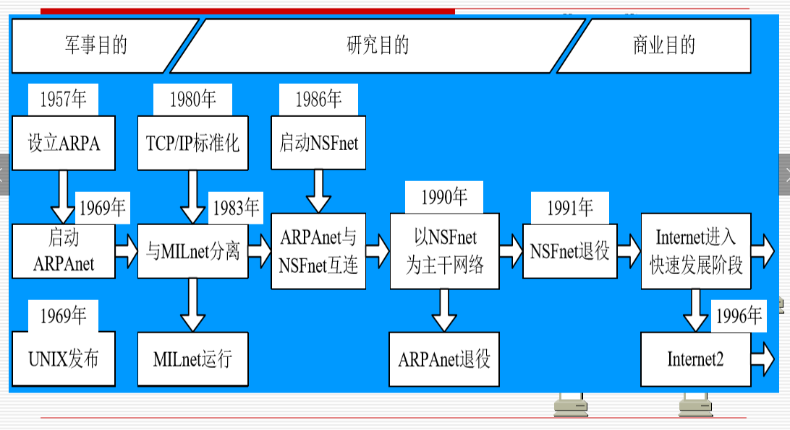

1. ARPAnet:为防止和攻击下核攻击下电信线路中断

### 1.3.1. 多层ISP结构的Internet
1. 互联网服务提供商(ISP,Internet Service Providers)

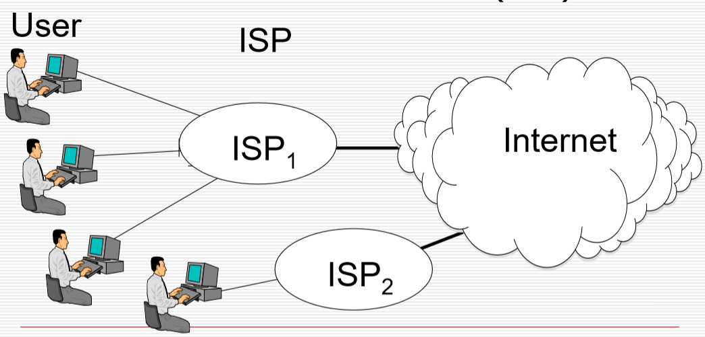
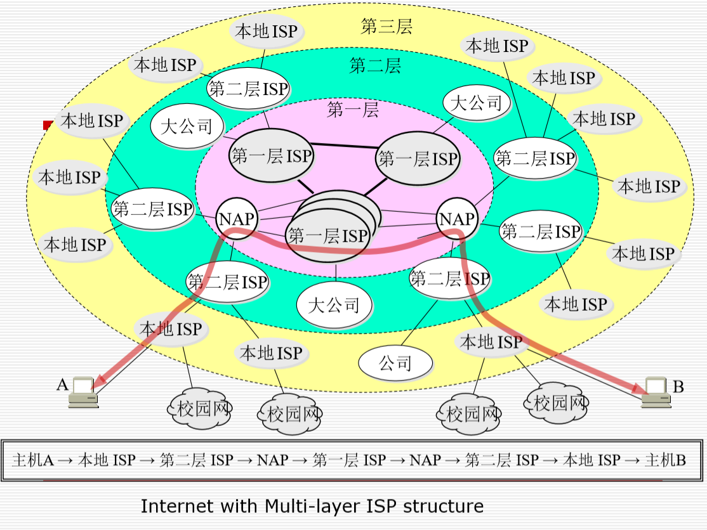

2. 第一层ISP是核心层，主要负责远距离连通。
3. 这种多层ISP结构可以将大量的流量本地化
4. NAP(Network Access Point):第一二层之间的接入点,也可以是google(大公司)直接和第一层ISP进行链接
5. ICP(Internet Content Provider):互联网内容提供商,不提供接入服务
6. 在低层次的ISP可以解决的问题就不进入上一层进行解决，将大量的流量分流。

# 2. 计算机网络基本概念

## 2.1. 数据
1. **数据按位(1和0)发送**。
2. **数据不是信息本身**，不同方式解析数据会是不同信息，比如UTF-8和GDK解码是不同的，数据都是0-1序列，需要按照一定编码格式翻译转码才成为信息。
3. 数据是一种信息的**编码形式**，它是一系列电脉冲/光信号，信息被传送到其中以便发送。

### 2.1.1. 数据报
1. 为了传输，计算机数据常常被分成容易传输的小单元。
    + 使用OSI模型，这些单元可以称为包、帧或段(Packets, Frames, and Segments)。
    + 网络层称为 packets 报文，数据链路层成为 frames 帧，数据段层称为 segments 段
2. **为什么使用数据包？**
    + 计算机可以轮流发送数据包，分时段处理不同报文，使得多进程处理事务。
    + 如果数据包丢失，则只需重新传输少量数据。TCP/IP下，我们分组传输，防止链路故障带来的问题。过大数据段会影响我们的重传、
    + 数据可以采用不同的路径，每个数据包可以单独传输。
3. 不同OSI层次使用不同传输形式，在不同层次数据被称为不同的单元名称。

| 层         | 单元英文 | 单元中文 |
| ---------- | -------- | -------- |
| 网络层     | packets  | 报文     |
| 数据链路层 | frames   | 帧       |
| 运输层     | segments | 段       |

## 2.2. 协议
1. 不同类型的计算机系统可以进行通信。通过不同通道，来完成对应的通信。
2. 所有设备必须使用相同的"语言"或使用相同的协议(使用相同的规则)。
    + 上下文处理关系
    + 单词:可以理解成为报文

## 2.3. 源地址和目标地址
1. 源地址指定发送数据包的计算机的标识。
2. 目标地址指定接收数据包的计算机的标识。
3. 通信往往是弱联系，要求报文携带源和目的地，以便于完成校验工作，可以在不提前通知的情况下进行通知。
4. 存在有效性的损失，因为source和destination是实际无用的信息，但是这是不可避免的

## 2.4. 传输介质

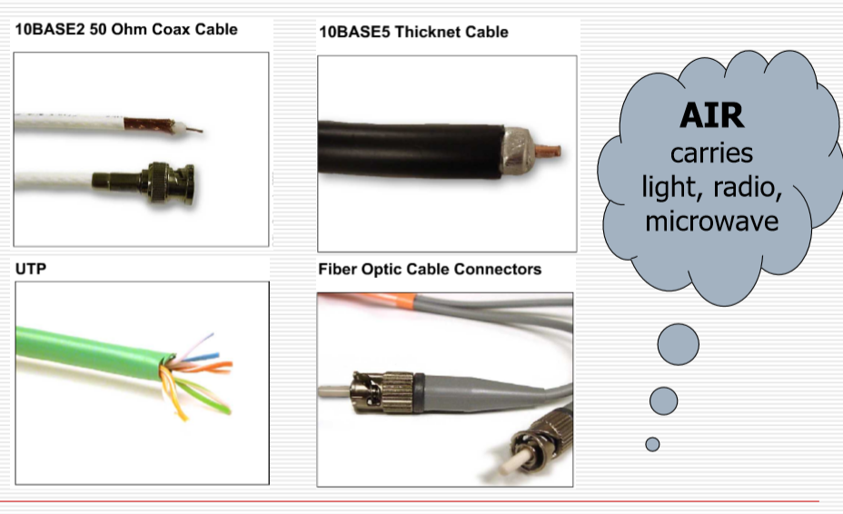

1. 介质是数据包传输所通过的介质
2. 传输方式
    1. 电缆方式
        + 铜轴有限方式
        + 双绞线方式
    2. 光缆方式:相对比较稳定，高速率传输都是用光缆。
    3. 空气方式

## 2.5. 数据带宽(BandWith)
1. 数据带宽使用来衡量在一段给定时间下有多少信息可以从一段流动到另一端。

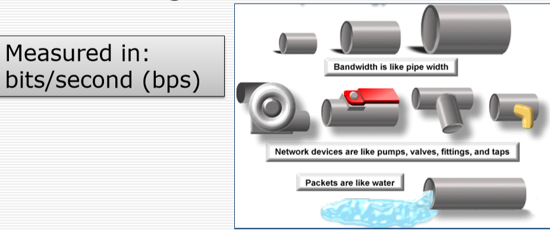

2. 带宽是传输能力的**上限**。
    + 单位:bps,计算时注意要将字转换为位。
    + 相对比较理想。

## 2.6. 通量(Thoughput)
1. 实际被度量的在特定时间情况下的数据带宽
2. Throughput <= Bandwidth 通量小于等于带宽
3. 一般是传送一个大的文件来进行计算出，实际的通量

# 3. OSI Reference Model (Open System Interconnection 参考模型)
1. 国际标准化组织(ISO，International Organization for Standardization)提出
2. 帮助网络建设者实现可以通信和协同工作的网络模型
3. 描述信息或数据如何从一台计算机通过网络移动到另一台计算机
4. 分层通信过程，每一个层次都有一个确定的任务。

## 3.1. 层次模型
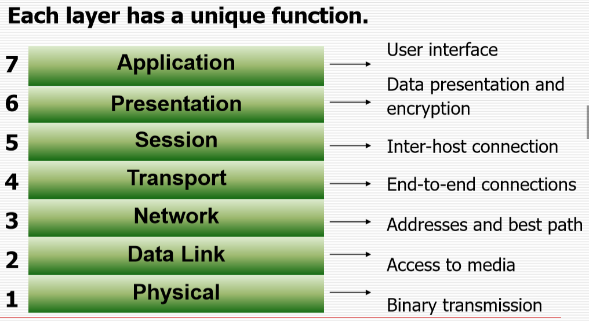

>OSI是7层网络模型

| 层次       | 特点                     | 关键字                   | 备注         |
| ---------- | ------------------------ | ------------------------ | ------------ |
| 物理层     | 二进制传输               | 信号和介质               | 属于数据流层 |
| 数据链路层 | 介质访问                 | 帧和介质访问控制         | 属于数据流层 |
| 网络层     | 路径选择                 | 路径选择，最优路径       | 属于数据流层 |
| 传输层     | 终端到终端通信           | 可靠性，流控制，错误纠正 | 属于数据流层 |
| 会话层     | 进程之间通信如何用户交流 | 对话和交流               | 属于应用层   |
| 展示层     | 展示                     | 标准                     | 属于应用层   |
| 应用层     | 给用户展示交互接口       | 浏览                     | 属于应用层   |

## 3.2. 为什么设计层次模型?
1. 降低复杂度，使用分解法来进行操作。
2. 标准化接口，每层和每层之间标准化处理
3. 促进(Facilitate)模块化工程，保证各层之间可以相对独立的进行发展
4. 确保交互操作的技术，可以用不同网络程序，但是都用一样的低层。
5. 加速(Accelerate)发展，各层的公司只要关注本层的即可
6. 简化教学和学习

## 3.3. 4+3模型

>最高3层被我们记为应用层，因为他们处理了用户接口，数据格式和应用权限

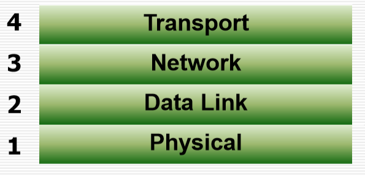

>底下四层被我们称数据流层，因为他们控制着通过网络传输的数据信息
>    + 这部分由硬件和网络操作系统一起完成
>    + 计算机网络主要讲的是这下四层

## 3.4. 各层次介绍
1. 下层会为上层提供服务，上层会向下层请求服务。
2. 考试OSI分层情况只有7层和4层的两种情况。

### 3.4.1. Layer 1:The Physical Layer 物理层
1. 关键词：**信号和介质**
2. 定义终端系统(包括媒体)之间链路的电气和功能规范(specifications)
3. 定义电压电平(voltage levels)、电压变化的定时(timing of voltage changes)、物理数据速率、最大传输距离、物理连接器和其他类似属性。(主要是定义了一些关键属性)
4. 特点:对于信号不管理，对于信号正确性不做判断，只传递信号。

### 3.4.2. Layer 2:The Data Link Layer 数据链路层
1. 关键词:**帧和介质访问控制** 
2. 通过物理链路提供**可靠**的数据传输
3. 涉及物理(而不是逻辑)寻址、网络拓扑、网络访问、错误通知、帧的有序传递和流控制，调节链路使用(涉及到一系列电路控制)
4. 和第一层区别:需要检查电信号的正确性，点对点的线路的链接，比如A-B之间的链接
5. 几个数据链路层:A-B,B-C,如果在两个链路则两个，反之则一个

### 3.4.3. Layer 3:The NetWork 网络层
1. 关键词:**路径选择，最优路径**，基于逻辑IP地址的路径选择、路由和寻址，第三层要基于protocol生成路由表。
2. 在路由发生的两个终端系统之间提供连接和路径选择
3. 它们(终端设备)可能位于地理上(geographically)分离的网络上
4. 和第二层区别:
    + 第二层只涉及到物理链路上点对点
    + 第三层上实现的是很多链路上的数据连通和传输。可以跨很远，在广域网上进行链路控制(逻辑电路控制)。
5. IP地址:逻辑地址，由本层分发IP地址。
6. 基于Package进行逻辑数据的管理。

### 3.4.4. Layer 4:The Transport Layer 运输层
1. 关键词:**可靠性，流控制，错误纠正**
2. 将数据分段并重新组合(reassembles)为数据流
3. 关心如何在网络上实现可靠的传输
4. 负责终端结点之间的可靠网络通信，并为虚拟电路的建立、维护和终止、传输故障检测和恢复以及信息流控制提供机制
5. 和第三层区别:
    + 第三层实现设备到设备之间的连接，但是我们的操作系统是分时操作系统，需要网络系统进行分时处理，保证为对应的数据进程转发正确的数据。
    + 复杂数据校验交给终端设备，而不是中间设备，中间设备能够完成转发即可，降低工程量
    + 数据错误:请求第三层(下层)重传
    + 互相协商:调整数据传输效率

### 3.4.5. The Layer 5:The Session Layer 会话层
1. 关键词:**对话和交流**
2. 建立、管理和终止通信主机之间的会话
3. 同步表示层实体之间的对话框并管理其数据交换
4. 提供高效的数据传输、服务类别以及会话、表示和应用层问题的异常报告
5. 管理表示层实体之间的数据交换
6. 和前四层相比:
    + 前四层不能处理具体的细节，所以需要我们在应用程序中完成应用的会话管理。
    + checkpoint:在相应时间检查数据是否同步。
    + 多进程的逻辑控制。

### 3.4.6. The Layer 6:The Presentation Layer 表示层
1. 关键词:**标准**，不同标准有可能出现歧义
2. 确保一个系统的应用层发送的信息可以被另一个系统的应用层读取
3. 使用通用数据表示格式在多个数据表示格式之间转换
4. 关注数据结构和数据传输语法(syntax)的协商
5. 负责压缩和加密，防止泄密事情的出现。

### 3.4.7. Layer 7: The Application Layer 应用层
1. 关键词:**浏览**，主要处理用户界面，将操作封装成机器可以理解的形式
2. 最接近用户的一层
3. 为用户应用程序提供网络服务
4. 不向任何其他OSI层提供服务

## 3.5. Protocols on ISO layers ISO模型下对应的协议内容
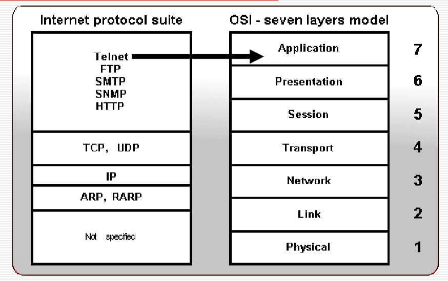

## 3.6. Data Encapsulation 数据封装
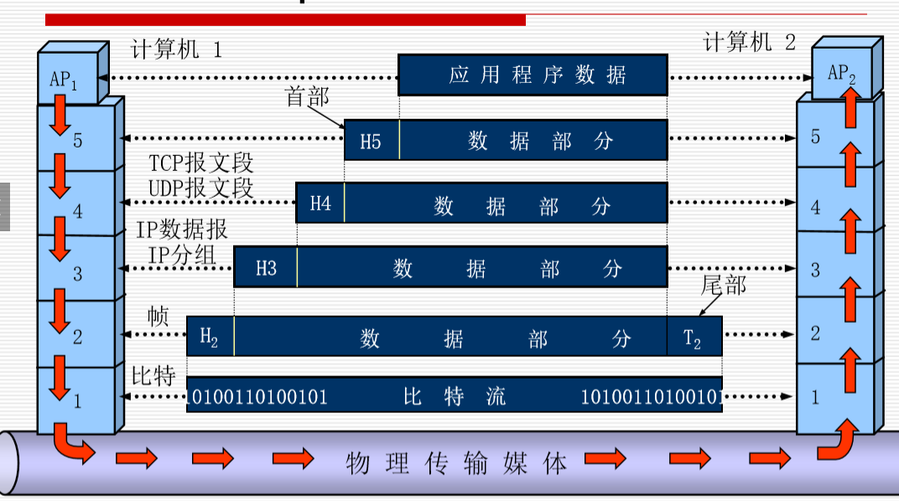

1. 5层划分不是实际标准，只是教学用标准
2. 五层划分:
    + 上三层:第五层，依据这三层其实是我们写的网络程序涵盖的
    + 传输层
    + 网络层
    + 数据链路层
    + 物理层
3. 数据封装过程
    + 5->4:添加首部H5，应用程序数据作为数据部分
    + 4->3:添加首部H4，第五层的作为数据部分
    + 3->2:添加首部H3，第四层的作为数据部分
    + 2->1:添加首部H2和尾部T2(校验位)，第三层的作为数据部分
    + 1:转成比特流进行发送
4. 直连线路上的操作

## 3.7. Peer-to-Peer Communications 点对点通信
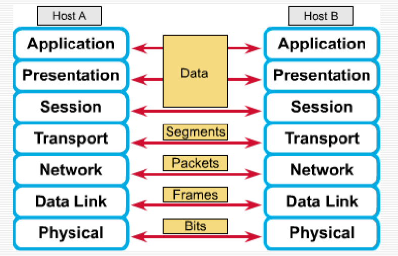

1. 各层之中交换的信息的类型是不同的
2. 不同层之间是无法完成正常通信的，也就是不能够理解的。
3. 现实场景:公司A和公司B签订合同，公司A的CEO对应应用层，公司B的CEO也对应应用层，传输纸质合同，通过快递来传输
    + A公司由秘书来起草具体的合同，之后快递工作交给收发室来传递，收发室找快递公司来完成具体快递等等。快递公司收到之后交给本地的集散点，然后通过具体的手段进行传递
    + 收件人可以使对应的科室
    + 上述描述了两台主机之间进行交互的过程

# 4. TCP/IP Model
1. 美国国防部(DoD,Department of Defense)创建了TCP/IP参考模型
2. 国防部希望其数据包在**任何情况**下，每次都能从一个点传输到另一个点。
3. 它带来了TCP/IP模型的创建
4. TCP/IP模式已经成为互联网发展的标准
5. TCP/IP model只有**四个**层。
    + 应用层
    + 传输层
    + 互联网层
    + 网络接入层
6. TCP: Transmission Control Protocal

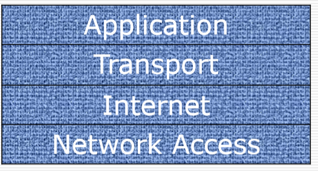

## 4.1. 四层模型 TCP/IP Model

### 4.1.1. 第四层：Application Layer 应用层
1. 处理高级协议、表示(representation)、编码(encoding)和会话控制(session control)问题，包含7层上三层:应用层、表示层、会话层的全部功能
2. TCP/IP将所有与应用程序相关的问题合并到一个层中，并确保将这些数据正确打包到下一层。

### 4.1.2. 第三层：Transport Layer 传输层
1. 处理服务质量的可靠性、流程控制和错误纠正问题。
    + 传输控制协议(TCP, Transmission Contol Protocol):代价比较大，效率比较低
    + 用户数据报协议(UDP, User Datagram Protocol)
    + 它将应用层信息打包成称为段的单元
2. 对应OSI的第4层：传输层

### 4.1.3. 第二层：Internet Layer 互联网层
1. 目的：从互联网上的任何网络发送源包，使它们独立于路径和网络到达目的地
2. 最佳路径确定和分组交换发生在这一层
3. 网际互联协议(IP,Internet protocol)
4. 和OSI的第三层：网络层对应，报文从一方发送给另一方，报文传输经过路由器进行路径选择，

### 4.1.4. 第一层：Network Access Layer 网络接入层
1. 也称为主机到网络层。
    + 合并了OSI下面两层:物理层和数据链路层
    + 完成物理实现和物理介质控制
2. 它涉及到IP数据包实际建立一个物理链路，然后再建立另一个物理链路所需的所有问题。
3. 它包括局域网和广域网的技术细节，以及OSI物理层和数据链路层的所有细节。

## 4.2. 常见的TCP/IP协议
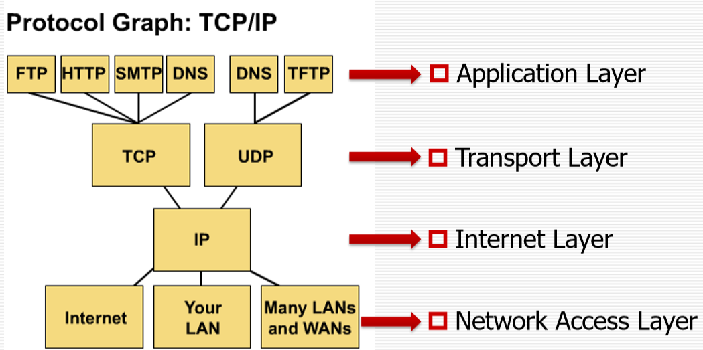

| 协议名称 | 协议全称                       | 中文名           | 备注                                        |
| -------- | ------------------------------ | ---------------- | ------------------------------------------- |
| FTP      | File Transfer Protocol         | 文件传输协议     | -                                           |
| HTTP     | Hypertext Transfer Protocol    | 超文本传输协议   | 主要用于浏览器                              |
| SMTP     | Simple Mail Transfer protocol  | 简单邮件发送协议 | 注意是发送                                  |
| DNS      | Domain Name System             | 域名解析系统     | 将域名解析成IP地址                          |
| TFTP     | Trivial File Transfer Protocol | 普通文件传输协议 | 基于UDP，在局域网发送，关于较小的文件的发送 |

1. 应用需要可靠传输:TCP服务,应用需要速率:UDP服务

## 4.3. TCP/IP 模型 和 OSI 模型的相似点

1. 两者都有层次，网络专业人员需要知道两者，都通过分层的方案来完成具体的实现
2. 两者都有应用层，尽管它们包含非常不同的服务
3. 两者都有相同的传输层和网络层
4. 假设采用分组交换(非电路交换)技术
5. OSI是基于报文交换来进行实现的，TCP/IP也是基于报文交换来完成实现的。

## 4.4. TCP/IP 模型 和 OSI 模型的不同点

1. TCP/IP看起来更简单，因为它有更少的层
2. **TCP/IP协议是Internet发展的标准，因此TCP/IP模型正是因为它的协议才获得了可信性。**
3. 通常网络不是建立在OSI协议之上的，即使OSI模型被用作指南。
4. **TCP/IP标准是大家都在使用的标准的。(实施标准)**，5层和7层都只是讲课使用的
5. 本课程我们一般使用**5层**来进行分割讲解。

# 5. 网络拓扑
1. 定义网络结构
2. 物理拓扑：导线(介质)的实际布局
    + 总线、星形、环形、扩展星形、分层(树形)、渔网型(mesh)
    + 如何把Node具体连接起来
    
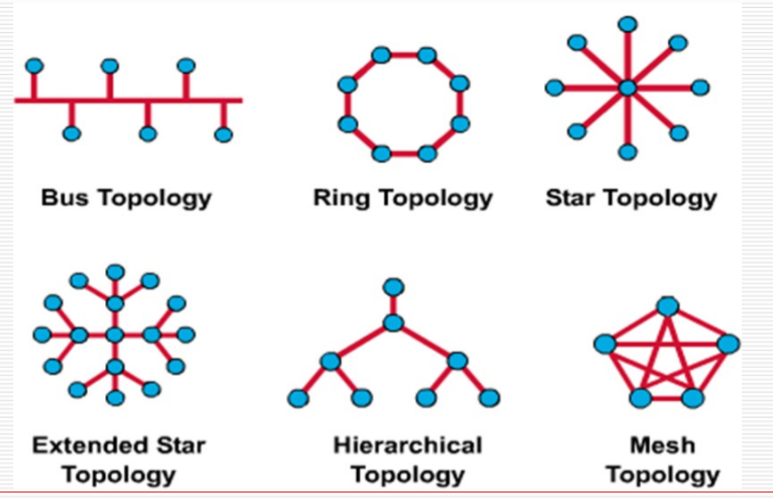

1. 逻辑拓扑：定义主机如何访问媒体
    + 令牌传递，使用token来获取通信的权利
    + 主要涉及到管理介质如何被访问
2. 逻辑拓扑:主要是指如何在逻辑上如何控制网络
3. 局域网特点：大部分时间是没有人发送数据，但是一旦发送就会有很多数据要发送。(令牌环循环不太适合)

## 5.1. Bus 总线型拓扑
1. 物理角度:每个主机都连接到一条公用线(总线)。
    + 优点：所有主机都可以直接通信。
    + 缺点：电缆断开会使主机彼此断开连接。
    + 也就是说总线是很重要的，总线一旦断开是不能够通信的，也是不可以分成多段总线进行处理(在未处理的总线上会在断开的地方，反射电信号，形成电路震荡)
2. 逻辑角度：每个网络设备都可以看到来自所有其他设备的所有信号，实际上是广播式传播
3. 优点:比较简单，所有的设备都可以监听到总线的信号。
4. 缺点:
    1. 信号冲突，需要进行复杂的介质访问权限控制来保证通信正常
    2. 如果一处断开，则全部无法进行网络传输

## 5.2. Ring 环形拓扑
1. 物理角度
    + 所有的设备直接首尾相连，组成一个菊花链(daisy-chain)
    + 可以将信息传送给链上的所有的设备，但是一般是固定顺时针或者逆时针进行传输
2. 逻辑角度
    + 为了使信息流动，每个站点必须将信息传递给其相邻的站点。
    + 我们需要对于链路进行访问控制，防止很多设备同时使用环，我们使用token来进行控制访问权力
3. 缺点:环上只要有一个地方断开就会破坏整个环
4. 令牌环拓扑主要用于控制领域，比较适用于实时系统的处理

## 5.3. Dual Ring 双环拓扑
1. 物理视角：
    + 双环拓扑结构与环拓扑结构相同，只是有第二个冗余环**连接相同**的设备。
2. 逻辑视角：
    + 双环拓扑就像两个独立的环，同一时间只有一个环被应用。
    + 有token令牌才有发送权力发送信息(使用总线)
3. 优点：提供可靠性和灵活性
4. Eg.优先使用外环，如果外环出现物理错误，则切换到内环上使用，并且对外环进行物理修复。
5. 双环拓扑是指一个结点有两个点，同时只能一个环在传输信息，两个环的传输时的方向是不能确定的。

## 5.4. Star 星型拓扑
1. 物理视角：星型拓扑结构有一个中心节点，所有的链路都从它辐射(radiating)出去。
2. 逻辑视角：所有信息的流动将通过一个设备。
3. 优点: 优点：它允许所有其他节点相互通信，方便。出于安全或限制访问的原因，它也可能是可取的
4. 缺点：如果中心节点出现故障，整个网络就会断开连接。根据使用的网络设备类型，冲突可能是一个问题，中心点会有很大的负担，并且容易造成通信阻塞。
5. 扩展星型拓扑:设置次级中心结点:和Internet的层次结点类似

## 5.5. Tree 树形拓扑结构
1. 树拓扑使用一个主干节点(Trunk Node)，从该节点分支到其他节点。
    + 二叉树(每个节点分成两个链接)
    + 主干树(主干有分支节点，其上挂有链接)。
2. 物理观点：主干是一条有几层分支的电线。
3. 逻辑观点：信息流是层次性的。
4. 在根一级数据结点可以对数据进行汇总和统计
5. 类似电信网络:中心点不仅仅是转存和发送，还要控制和统计，而星形拓扑是不需要控制统计的。
6. 当前节点不能处理的部分，则交给父结点处理

## 5.6. Complete(Mesh) 渔网型拓扑
1. 物理视角:有明显的优点和缺点
2. 逻辑角度:完整或网格拓扑的行为在很大程度上取决于所使用的设备。
3. 优点：最大的连接性和可靠性。
4. 缺点：链接的媒体数量和到链接的连接数量变得非常庞大。
5. 全连接拓扑
    + 缺点:成本高、路径选择多:添加选择最合理的路径的机制
    + 优点:鲁棒性高，抗干扰能力强。
6. 常使用在比较使用重要的情况下:通常Internet就是使用Mesh的拓扑

## 5.7. Cellular 蜂窝型拓扑

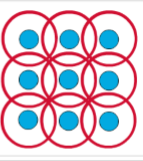

1. 物理视角
    + 蜂窝拓扑结构是用于无线技术的拓扑结构
    + 有时接收节点移动(如手机)，有时发送节点移动(如卫星)
2. 逻辑视角:节点之间直接通信(尽管有时非常困难)，或者只与相邻的单元通信，这是**非常低效**的。
3. 每一个结点都是无线的连通方式:远结点需要进行转发
4. 使用场景
    1. 无线电话
    2. 卫星

# 6. Network Devices 网络设备
1. ad hoc(无线网络拓扑结构)性能比较差，容易受干扰

## 6.1. 拓扑的局域网设备
1. Hosts(网络终端设备):主机设备直接连接到网段,网络边缘节点，比如打印机、计算机、服务器、传真机、复印机
2. Hosts(网络中间设备):主机不是任何层的一部分，但是OSI模型的功能是在主机内部的软件中执行的

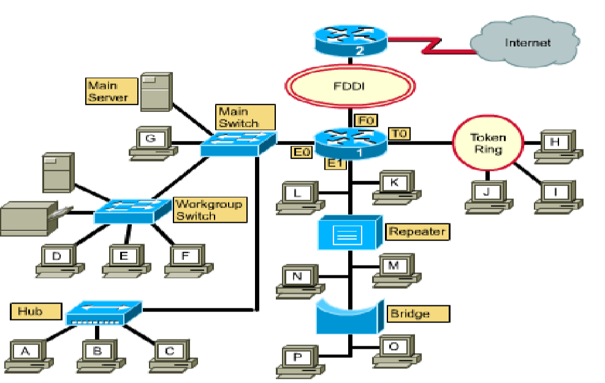

3. 两者差别:网络终端设备可能工作在比较复杂的层次上，工作在多个层次上。

## 6.2. NICs - Layer2 网卡 Network Interface Controller(网络终端设备)

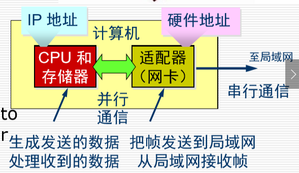

1. 携带称为MAC地址的唯一代码，固定地址，在芯片上
2. 用于控制网络上主机的数据通信
3. 将计算机产生的并行信号转换成串行格式通过网络发送
4. 用于转换信号以及发送和接收比特的收发器
5. \提供主机对媒体的访问权限
6. 为什么是第二层的设备:
    1. 可以识别帧
    2. 帮助主机接入网络
7. 计算机母线:并行通信，网卡总线:串行通信，所以网卡需要完成两者之间的交换。
8. 也是可以完成第一层的工作的

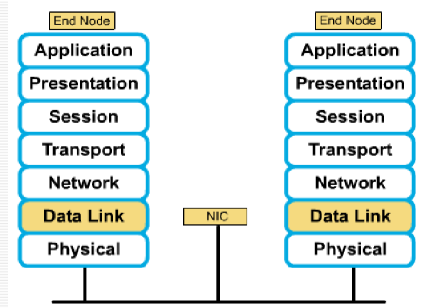

## 6.3. Media – Layer 1 介质 网络中间设备
1. 以位为单位携带信息流
2. 信号从一个网络设备传送到另一个网络设备的方式
3. 0-1信号变为电信号或者无线电波光信号等。

## 6.4. Repeaters – Layer 1 中继器 网络中间设备
1. 用于**延长网络的长度**，实现传输超出一段介质传输的介质
2. 清除(Clean)、放大(Amplify)和重发(Resend)被长电缆削弱的信号
3. 在比特级别重新生成(放大)和重定时网络信号(**数字信号**)，以允许它们在媒体上传播更长的距离
4. 不执行筛选，无条件中继。

## 6.5. Hubs - Layer 1 集线器 网络中间设备
1. 用于重新生成和重定时网络信号，连接多个端口，可以比repeaters做更多的事情
2. 传播信号，无法筛选流量，无法确定最佳路径，经常用作网络中心结点，有时候被称为多端口中继器
3. 逻辑拓扑上:总线方式连接，一个端口入，所有端口出
4. 不允许总线上同时有两路信号进行传输
5. 冲突域:可能出现冲突的区域，但是hubs不进行这些控制，而是由交换机或者路由器来完成控制,不能降低了冲突概率
6. 而放大器方法的是模拟信号。

### 6.5.1. 中继器和集线器的不同
1. 中继器通常只有两个端口，集线器通常有4到20个或更多端口。
2. 中继器在一个端口上接收，在另一个端口上重复，而集线器在一个端口上接收，在所有其他端口上传输。
3. 集线器最常见于以太网10Base T或100Base T网络中，最近已经不怎么使用
4. 都是转发，都不做过滤功能
5. 两个设备之间最多有4个hubs和bridge

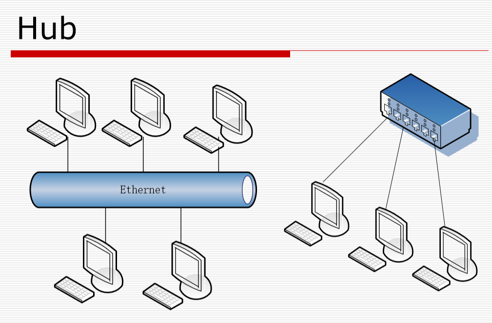

## 6.6. Bridges – Layer 2 网桥 网络中间设备
1. 目的是在LAN上过滤流量，以保持本地流量，但允许连接到LAN的其他部分以定向到那里的流量
2. 跟踪网桥两侧的MAC地址，并根据此MAC地址列表进行决策
    + 目的地址如果在同一端，就不进行转发(不必进行转发，MAC Table)
    + 而在不同侧(不同的segments)就进行尽量向外转发
3. 比集线器更智能
4. 收集并在段之间传递数据包
5. 创建冲突域
    + 通过网桥划分冲突域
    + 每个冲突域中都有一定的主机
    + 第一层以上的设备才能划分冲突域
6. 维护地址表

## 6.7. Switches – Layer 2 交换机 网络中间设备
1. 用于集中连接，将集线器的连通性与桥梁的交通管制相结合
2. 将帧从输入端口切换到输出端口，从而为每个端口提供全带宽
3. provide separate data paths 提供单独的数据路径
4. 结合网桥和交换机的功能
5. 为每个端口都配备Mac Table：如果找到匹配的情况，在将这两个端口建立临时链接
6. 功能上:交换机的每个端口对应一个冲突域，和网桥是一样的。交换机和hubs相比，在物理和逻辑上都是星型拓扑。
7. 目前主要都是基于交换机来进行实现的
8. 不能做到网络逻辑划分，IP逻辑划分是路由器的事情

## 6.8. Routers – Layer 3 路由器 网络中间设备
1. 大型网络中重要的流量调节设备
2. 根据网络地址进行决策：主要是进行网段的划分，根据网络地址(包含在IP地址中)进行转化
3. 检查数据包(第3层数据)，为它们选择最佳路径，然后将其切换出正确的传出端口
4. 两个主要目的：
   1. 路径选择
   2. 将数据包切换到最佳路由

## 6.9. 网络设备和OSI层次模型演变(Evolution)
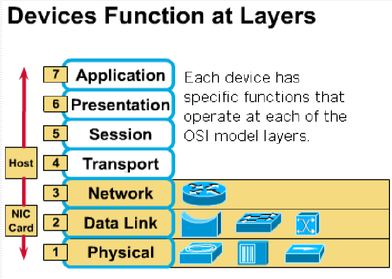

1. 网络设备的工作层次和主机情况
    + 物理层:介质、repeaters、hubs
    + 数据链路层:网桥、交换机、电路交换设备
    + 网络层:路由器
2. Host下层通过网卡进行实现，上层通过网络操作系统、应用实现
3. 高层设备可以识别低层设备的信号，但是低层次是不能识别高层次的数据逻辑的