lecture02-物理层
---

<!-- TOC -->

- [1. 网络连接类型](#1-网络连接类型)
- [2. 局域网介质](#2-局域网介质)
  - [2.1. UTP (无屏蔽双绞线 Unshielded Twisted Pair)](#21-utp-无屏蔽双绞线-unshielded-twisted-pair)
    - [2.1.1. 无屏蔽双绞线的优点](#211-无屏蔽双绞线的优点)
    - [2.1.2. 无屏蔽双绞线的缺点](#212-无屏蔽双绞线的缺点)
  - [2.2. 同轴电缆 Coaxial](#22-同轴电缆-coaxial)
  - [2.3. 光缆 Fiber-Optic](#23-光缆-fiber-optic)
    - [2.3.1. 光缆模式(Mode Type)](#231-光缆模式mode-type)
  - [2.4. 无线通信 Wireless Communication](#24-无线通信-wireless-communication)
  - [2.5. 无线传输手段 Wireless Transmission Methods](#25-无线传输手段-wireless-transmission-methods)
- [3. UTP for Ethernet 以太网使用的双绞线](#3-utp-for-ethernet-以太网使用的双绞线)
  - [3.1. 电缆规格和终端](#31-电缆规格和终端)
  - [3.2. 无屏蔽双绞线的分类](#32-无屏蔽双绞线的分类)
  - [3.3. 线的类型](#33-线的类型)
    - [3.3.1. 直通线](#331-直通线)
    - [3.3.2. 反转线](#332-反转线)
    - [3.3.3. 交叉线](#333-交叉线)
- [4. 介质和信号问题(物理层)](#4-介质和信号问题物理层)
  - [4.1. 信令和通信问题](#41-信令和通信问题)
  - [4.2. 冲突和冲突域 Collisions and Collision Domains](#42-冲突和冲突域-collisions-and-collision-domains)
  - [4.3. 分割碰撞域 Segmenting Collision Domains](#43-分割碰撞域-segmenting-collision-domains)
- [5. 数据通信的基础信息](#5-数据通信的基础信息)
  - [5.1. 基本术语](#51-基本术语)
  - [5.2. 理论基础:信号处理](#52-理论基础信号处理)
  - [5.3. 数字信号通过实际的信道](#53-数字信号通过实际的信道)
  - [5.4. 无噪声信道的最高传输速率](#54-无噪声信道的最高传输速率)
  - [5.5. 噪声信道的最高传输速率](#55-噪声信道的最高传输速率)
  - [5.6. 理论基础:波特率和比特率](#56-理论基础波特率和比特率)
  - [5.7. 数据通信系统的模型](#57-数据通信系统的模型)
  - [5.8. 数据通信技术：数字数据编码](#58-数据通信技术数字数据编码)
  - [5.9. 将数字数据转换到模拟信号：调制](#59-将数字数据转换到模拟信号调制)
  - [5.10. 将数字数据转换到数字信号：线路编码](#510-将数字数据转换到数字信号线路编码)
  - [5.11. 数字通信技术:编码方式的分类](#511-数字通信技术编码方式的分类)
    - [5.11.1. 单极性编码](#5111-单极性编码)
    - [5.11.2. 极化编码：不归零制码(NRZ: Non-Return to Zero)](#5112-极化编码不归零制码nrz-non-return-to-zero)
    - [5.11.3. 极化编码：归零制码（RZ: Return to Zero）](#5113-极化编码归零制码rz-return-to-zero)
    - [5.11.4. 极化编码：曼彻斯特码（Manchester）](#5114-极化编码曼彻斯特码manchester)
    - [5.11.5. 极化编码：差分曼彻斯特码（Differential Manchester）](#5115-极化编码差分曼彻斯特码differential-manchester)
    - [5.11.6. 双极性编码：双极性传号交替反转码（AMI）](#5116-双极性编码双极性传号交替反转码ami)
    - [5.11.7. 数据通信技术：多路复用](#5117-数据通信技术多路复用)
  - [5.12. 多路复用的分类](#512-多路复用的分类)
    - [5.12.1. 时分复用TDM (Time Division Multiplexing)](#5121-时分复用tdm-time-division-multiplexing)
    - [5.12.2. 统计时分复用 STDM (Statistic TDM)](#5122-统计时分复用-stdm-statistic-tdm)
    - [5.12.3. 频分复用 FDM (Frequency Division Multiplexing)](#5123-频分复用-fdm-frequency-division-multiplexing)
    - [5.12.4. 波分复用 WDM (Wavelength Division Multiplexing)](#5124-波分复用-wdm-wavelength-division-multiplexing)
    - [5.12.5. 码分复用 CDM (Code Division Multiplexing)](#5125-码分复用-cdm-code-division-multiplexing)
- [6. 其他注释](#6-其他注释)

<!-- /TOC -->

# 1. 网络连接类型

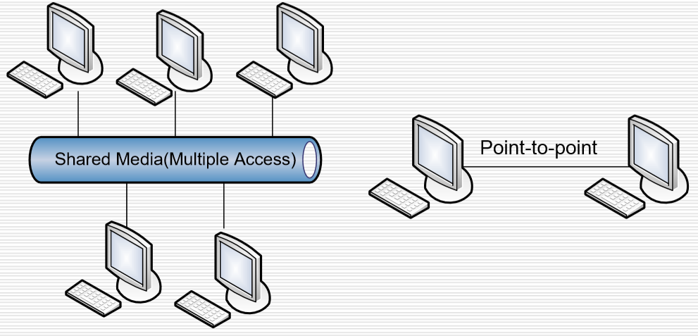

1. 多路复用共享介质
    + 多个主机可以访问同一介质
    + 这意味着它们都共享相同的介质—即使“wire”可能是UTP，它有四对线
2. 点对点(Point To Point)网络
    1. 一个设备通过链路连接到另一个设备
    2. 最广泛地应用于拨号网络连接，也是你最熟悉的一种。使用电信号来完成传输。

# 2. 局域网介质
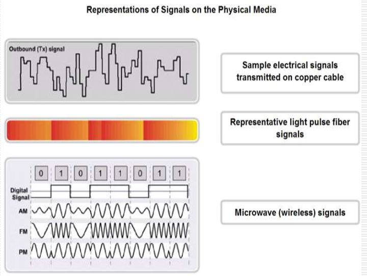

>第一类传输电信号，第二类传输光信号，第三类传输无线电波。
1. 功能是传输数据
2. 光信号、无线信号等传输过程称为**编码**
3. 电缆类型包括STP(有屏蔽双绞线)、UTP(无屏蔽双绞线)、同轴电缆、光纤
4. 调节频率、电压、相位等方式来实现不同01编码

## 2.1. UTP (无屏蔽双绞线 Unshielded Twisted Pair)
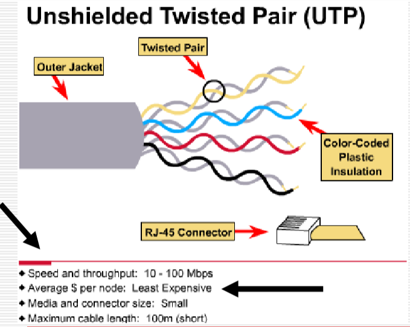

>由八根子线组成,两个线组合成一组，共四组，可以保证每一组电流抵消电磁波干扰(抗干扰能力有限)
1. 仅(solely)依赖于消除效应，由双绞线对产生，以限制由EMI和RFI引起的信号退化
2. 有四对铜线，阻抗(impedance)为100欧姆，频率低、接口小、布线更加方便。
5. 一般认为有效范围为100m

### 2.1.1. 无屏蔽双绞线的优点
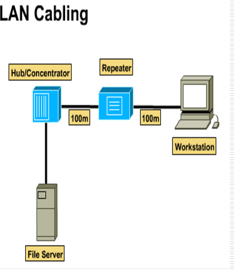

1. 易于安装且成本较低，线薄接口小
2. 每米成本低于任何其他类型的局域网布线
3. 较小的外径不能像其他类型的电缆那样迅速地填满布线管道(duct)
4. 使用RJ连接器安装，因此可以大大减少潜在的网络噪声源，并确保良好的可靠连接

### 2.1.2. 无屏蔽双绞线的缺点
1. 与其他类型的网络媒体相比，电缆更容易产生**电噪声和干扰** 
2. 双绞线的信号增强距离比同轴电缆(Coaxial)和光纤(Fiber-Optic)**短**

## 2.2. 同轴电缆 Coaxial
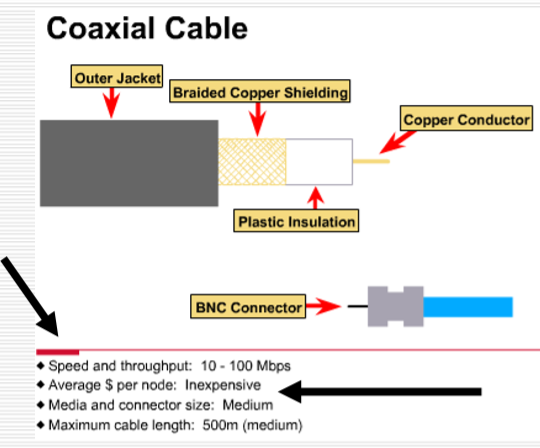

1. 薄/厚
2. 与双绞线相比，不使用中继器的网络运行时间更长
3. 比光纤便宜但比双绞线贵
4. 中间是铜导线，在外面缠上一层金属网，防止外部干扰，细导线传输相对近，粗导线传输相对比较远
5. 500m左右，无论如何比双绞线传输更加远，成本也要高一点
6. 内置无线网卡肯定没有同轴电缆，同轴电缆是比较落后的工艺。

## 2.3. 光缆 Fiber-Optic
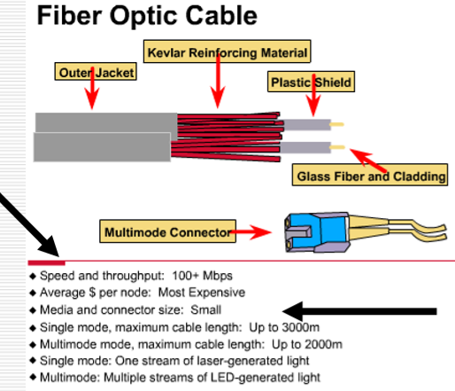

1. 传导调制(modulated)光传输
2. 不易受到电磁干扰或射频干扰，并且能够比其他网络媒体更高的数据速率
3. 电磁波(electromagnetic wave)通过光纤被引导
4. 比较可靠，中间是二氧化硅(光导体)，外面是塑料套，两个接口一个接收一个发送
5. 成本比较高

### 2.3.1. 光缆模式(Mode Type)
1. 单模式：单个光传输
    + 也称为轴(axial)：光沿着电缆的轴传播
    + 由于多模中的色散(dispersion)，比多模（高达10 Gbps）更快
    + 通常用于广域网
    + 直径小于多模（色散较小）
    + 最常使用ILD，但也使用LED
    + 光导体直径比较细，相对于多模式光缆要细一个数量级，认为光传输近似直射，能量损耗少，多用于广域网
2. 多模式 多根光不同角度传输 Multimode Multimode 
    + 光以不同的角度进入玻璃管并沿非轴方向传播，这意味着它从玻璃管壁上来回反射
    + 大于单光模式，最常用于局域网
    + 易受更大分散性的影响
    + 光导体直径大一些，同时传输多光信号，按照角度进行识别，一个上面实现多路传输，能量损失大一些(反射)
3. 都需要用注入式激光二极管或者发光二极管进行发射

## 2.4. 无线通信 Wireless Communication
1. 区分不同电磁波的主要方法是通过其频率（频率多路复用） 

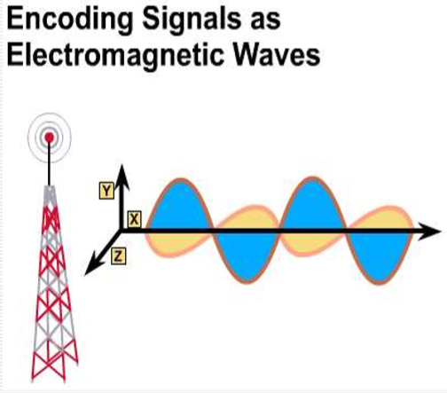

2. 把信号编码成为电磁波的方式
    + 不同设备使用不同频段，可以互不干扰

## 2.5. 无线传输手段 Wireless Transmission Methods
1. 激光 Lasers
    + 输出一个相干(coherent)的电磁场，其中所有的波都在同一频率上，并在同一相位上排列
    + 约定好电磁波频率范围，使用确定对射方案进行传输，部署在中间没有障碍物的两端之间，不能衍射
2. 红外线 Infrared
    + 通常是一种瞄准线(line-of-sight)技术，但可以反弹(bounced)或重定向
    + 无法通过不透明对象
    + 红外能量要比激光弱的多，成本低，不能衍射，不能跨障碍物传输
3. 收音机 Radio
    + 携带可以通过墙壁的数据信号
    + 地面(terrestrial)和卫星无线电技术
    + 可以通过衍射使得信号在比较远的距离和障碍物之间进行通信
    + 传输距离比较远，辐射能量小，容易受到干扰，比如雨天能量会损失，在功率较大的设备旁边容易被干扰
    + 路设发送信号:无线电台，卫星发射信号:GPS

# 3. UTP for Ethernet 以太网使用的双绞线

## 3.1. 电缆规格和终端
1. 网络媒体标准由下列团体制定和发布：
    + 电气与电子工程师学会 制定硬件标准，指定一些新型的协议。
    + 保险商实验室
    + 电子工业联盟
    + 电信工业协会
    + 美国国家标准协会

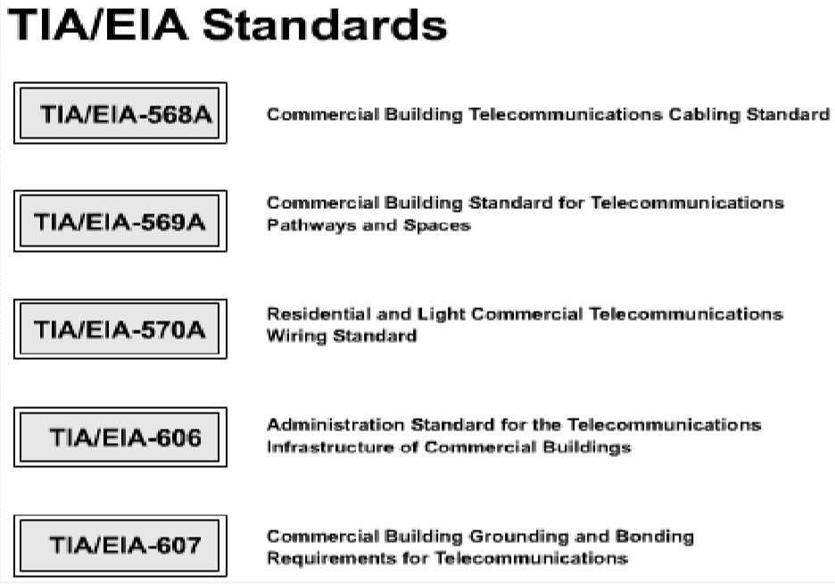

1. 对应不同的接地等标准

## 3.2. 无屏蔽双绞线的分类
1. 一类线：主要用于语音传输，不用于数据传输，只有两根线做双绞线，常用作电话的语音通信，并不做语音进行通信
2. 二类线：传输频率1MHz，用于语音和最高4Mbps的数据传输，常见于令牌网环网，不是很常用
3. 三类线：EIA/TIA568标准指定电缆，传输频率16MHz，用于语音传输及最高传输速率为10Mbps的数据传输，主要用于10BASE-T(10M带宽的双绞线)
4. 四类线：传输频率为20MHz，用于语音传输和最高传输速率16Mbps的数据传输，主要用于令牌网和 10BASE-T/100BASE-T
5. 五类线：增加了绕线密度，外套高质量绝缘材料，用于语音和数据传输(主要为100/1000BASE-T)，是最常用的以太网电缆
    + 和三类线相比，绞合度更高，抗干扰能力更强。
    + 从五类线开始进行了更加标准化的处理。
6. 超五类线(主要使用的)：衰减小，串扰少，具有更高的衰减/串扰比和信噪比、更小的时延误差，主要用于1000BASE-T
7. 六类线：传输频率为1MHz～250MHz，性能远高于超五类标准，适用于高于1Gbps的应用
8. 七类线：带宽为600MHz，可能用于今后的10G比特以太网。

## 3.3. 线的类型
1. 直通线
2. 反转线
3. 交叉电缆
4. 两个台式机直连使用交叉线，台式机和交换机相连使用直通线。

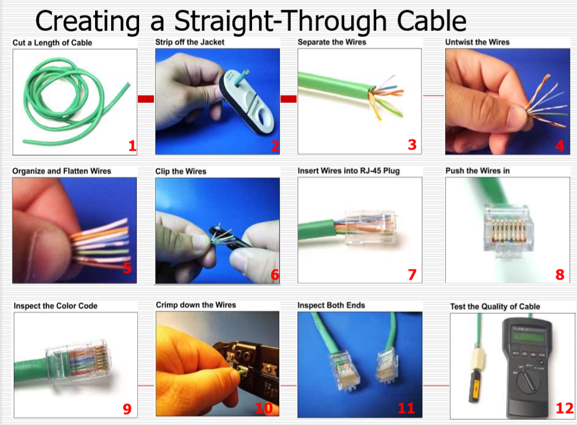

>制作线的过程见上图

### 3.3.1. 直通线
1. 100欧姆平衡双绞线电信插座/连接器

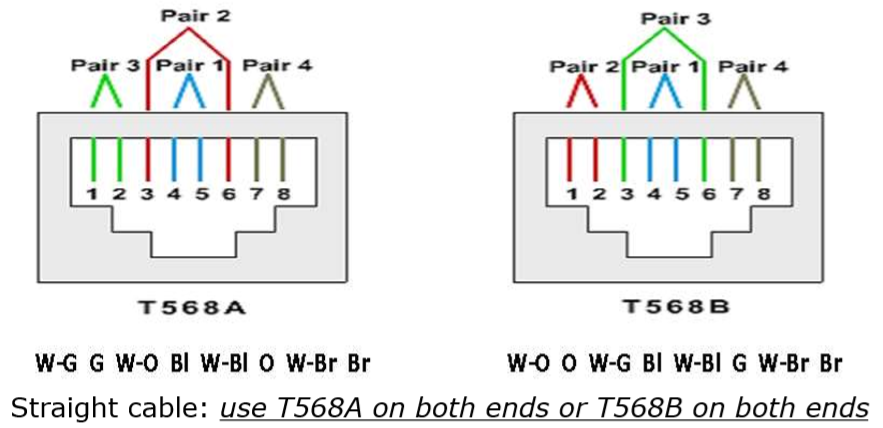

2. 双绞线是八根不同子线，根据颜色进行划分,从左到右(底下):白绿色、绿色、白橙色、蓝色、白蓝色、橙色、白棕色、棕色
3. 两边都是T568A或者都是T568B的则是直通线

### 3.3.2. 反转线
1. 别名：控制台电缆,将计算机作为其他网络设备的控制台，如下解释
2. 用于将工作站或终端连接到路由器/交换机的控制台端口以进行配置
3. 一端的插脚1连接到另一端的插脚8；然后插脚2连接到插脚7，插脚3连接到插脚6，依此类推，两端是插脚对应是反着的
4. 使用控制台配置设备(超级终端，使用电脑进行交换机路由器的配置)
    + 使用RJ-45-to-DB-9适配器连接计算机的串行端口（com） Connect the serial port (com) of computer by using RJ-45-to-DB-9 adapter
    + 启动“超级终端” Start up “super terminal”
    + 使用“默认配置” Use “default configurations” 
    + 注意，我们连接的是console端口，而不能是网口。

### 3.3.3. 交叉线
1. 电缆一端的对2和对3将在另一端反转，一端为T568-A的排序，另一端为T568-B的排序
2. 被认为是“垂直”布线/主干的一部分 
3. 可以用来
    1. 连接两个或多个集线器或开关
    2. 连接两个独立的工作站以创建小型
4. 主要用来连接相同的设备，相同的PC之间的连接
5. 堆叠技术:用交叉线来两个交换机(将两个交换机合成为一个交换机进行使用)或者两个hubs，2个8口交换机，通过一根线连接，则有14个端口

# 4. 介质和信号问题(物理层)

## 4.1. 信令和通信问题
1. 传播(本质是电磁波) Propagation
    + 行程时间；速度取决于介质
    + 随着数据传输速率的增加，有时必须考虑信号传输所需的时间。
    + 不同介质传播时间是不同的。传播时延。
2. 衰减 Attenuation
    + 由于**周围环境(surroundings)**造成的远距离信号丢失
    + 会影响网络，因为它限制了可以通过其发送消息的网络布线的长度
    + 在有限长度下进行传输
3. 反射 Reflection
    + 由介质的不连续性引起，我们要保证介质稳定。
    + 发生在电信号中；可能是电缆扭结(kinks)或电缆端接不良的结果
    + 网络应具有特定的阻抗，以匹配NIC中的电气组件
4. 噪声(电子干扰) Noise 
    + 对光/电磁信号的不必要的附加
    + 电缆中其他电线的串扰电噪声
    + EMI（电磁干扰）可由电动机引起。
    + 可以通过扭转线对在网络介质中提供自屏蔽来避免信号的消除。
5. 时间问题 Timing problem
    + 色散信号在时间上，可以通过适当的电缆设计、限制电缆长度和找到适当的阻抗来固定
    + 抖动源和目标不同步，可通过硬件和软件（包括协议）修复
    + 网络信号延时

## 4.2. 冲突和冲突域 Collisions and Collision Domains
1. 当两个位元在同一网路上同时传播时，会发生碰撞。
2. 通过添加中继器和集线器**扩展**冲突域。
3. 可以通过添加智能设备（如网桥、交换机和路由器）来分割网络。
4. 到第二第三层(分段后)才能有效划分冲突域，第一层不能解决冲突问题。

## 4.3. 分割碰撞域 Segmenting Collision Domains
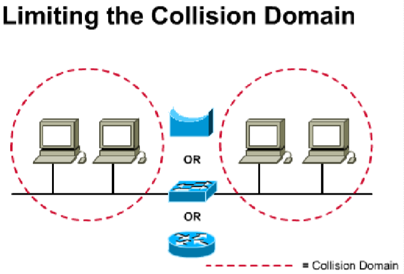

1. 将不同的冲突域进行分段(第一层设备无法解决这些问题)，还是在一个局域网中
2. 局域网划分是根据TCP/IP的协议栈的IP查询的，到三层才能做网络的分段。

# 5. 数据通信的基础信息

1. 数据通信的理论基础:**为什么带宽是有上限的**
    1. 基本术语
    2. 信号处理
    3. 波特率与比特率
2. 数据通信技术
    1. 数据通信系统基本结构
    2. 数据表示和传输方式
    3. 信号的传输
    4. 数字信号编码
    5. 多路复用
    6. 通信方式
3. 参考计算机网络教材，思科网络教程是没有的。

## 5.1. 基本术语
1. 信号(signal)——数据的电气的或电磁的表现。传输的是数据。
    + “模拟的”(analogous)——消息的参数的取值是**连续**的，模拟信号是随时间变化而平稳变化的连续波形式
    + “数字的”(digital)——消息的参数的取值是离散的，数字信号是离散信号，可能包含有限的几个预定值
2. 码元(code)——在使用**时间域**（或简称为时域,基本时间单位）的波形表示数字信号时，代表不同离散数值的基本波形。
    + 传输基本单位，并不一定只包含一位，比如有8个单位，那么我们可以根据波形分为8种，8种区分可以传输三位，23 = 8

## 5.2. 理论基础:信号处理
1. 模拟信号可以被分为简单信号和复合信号
    + 简单信号（**正弦波**）不能被分解为更简单的模拟信号
    + 正弦波和余弦波也就只差一个相位，问题不大。
    + 一般使用正弦波来进行表示。
    + 复合信号可以被分解为多个正弦波
2. 复合模拟信号的分解：**傅立叶分析**，任何一个周期为T的有理周期性函数g(t)可分解为若干项（可能无限多项）正弦和余弦函数之和：

3. 数字信号一般是**非周期性**的，通常在传输介质上表现为**方波**，非周期函数也可以变换成周期函数来进行分析
4. 一个数字信号可以分解为无穷多个被称为**谐波**的简单正弦波，每个谐波都具有不同的**频率与相位**，最后组合成一个方波。
5. 在介质上发送数字信号时，其实质是在发送无穷多的简单谐波，如果某些分量未能忠实地通过介质传输，则在接收端将产生信号**畸变**。
6. 由于介质本身的限制，信号畸变是难以完全避免的:传输距离越远、传输速率越高，越容易受到干扰。
7. 任何实际的信道都不是理想的，在传输信号时会产生各种失真以及带来多种干扰。
8. 码元传输的速率越高，或信号传输的距离越远，在信道的输出端的波形的失真就越严重

## 5.3. 数字信号通过实际的信道
1. 有失真，但可识别:形变只要不是不可识别还是可以被处理的。

2. 失真大，无法识别:无法区分，码间串扰(无法识别每一个码元)

## 5.4. 无噪声信道的最高传输速率

1. 1924 年，奈奎斯特(Nyquist) 指出在假定无噪声的信道上，为避免**码间串扰**，传输比特率的上限值为：
    + C = W log2L bps
    + W 为信道的带宽（以 Hz 为单位），传输信号的频率(上限)
    + L 为表示数据的信号电平的数量(码元能表示的信息数)，能表示8个，则为3。
2. 在任何信道中，码元传输的速率是有上限的，否则就会出现码间串扰的问题，使接收端对码元的判决（即识别）成为不可能。
3. 如果信道的频带越宽，也就是能够通过的信号高频分量越多，那么就可以用更高的速率传送码元而不出现码间串扰
4. 这是理想情况下，没有信道干扰。

## 5.5. 噪声信道的最高传输速率
1. 香农(Shannon)用信息论的理论推导出了带宽受限且有高斯白噪声干扰的信道的极限、无差错的信息传输速率
2. 信道的极限信息传输速率 C 可表达为
    + C = W log2(1 + S/N) bps
    + W 为信道的带宽（以 Hz 为单位）
    + S 为信道内所传信号的平均功率
    + N 为信道内部的高斯噪声功率(用高斯概率公式去拟合)
    + S/N 称为信噪比
3. 香农公式的含义
    1. 信道带宽或信道的**信噪比**越大，极限传输速率越高
    2. 只要信息传输速率低于信道的极限信息传输速率，就**一定**有办法实现无差错的传输。
    3. 若信道的带宽 W 或信噪比 S/N 没有上限（实际不 可能），则其极限信息传输速率 C 也没有上限
    4. 实际能够达到的传输速率比香农极限传输速率**低不少**
    5. 请注意：对于频带宽度已确定的信道，即使信噪比不能再提高，且码元速率已达上限，也**有办法提高**传输速率。这就是用编码的方法让每个码元携带更多比特的信息量

## 5.6. 理论基础:波特率和比特率
1. 波特率（baud）和比特率（bit）
    + 波特率（调制速率）：波信号每秒钟变化的次数
    + 比特率：每秒钟传送的二进制位数。
2. 波特率与比特率的关系取决于信号值与比特位的关系
    + 例：每个信号值表示为3位，则比特率是波特率的3倍； 每个信号值表示为1位，则比特率和波特率相同 
    + 对于比特率为a bps的信道，发送8位所需的时间为 8/a秒，若8位为一个周期Ｔ，则一次谐波的频率是：f = a/8 Hz

## 5.7. 数据通信系统的模型
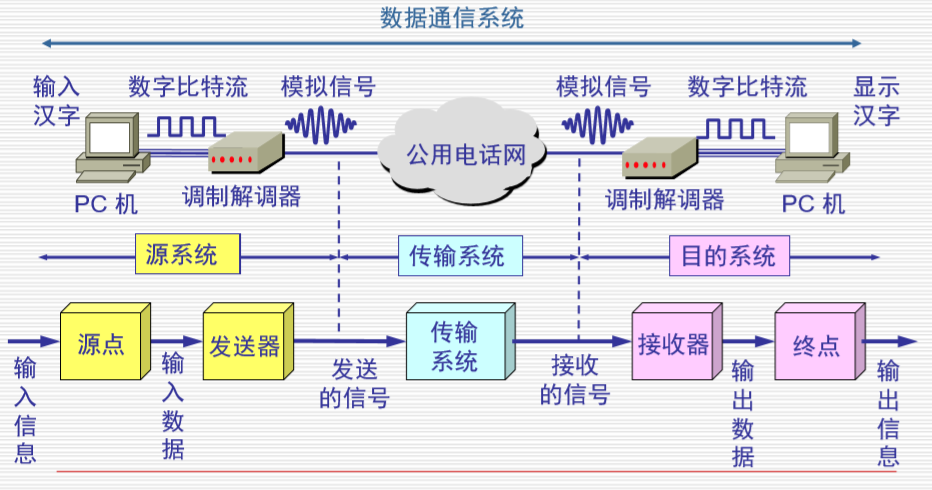

1. 在传输工程中，首先从输入方(原系统，数字比特流)，经过传输系统(比较远，用模拟信号系统)，到达目的系统(数字比特流)
2. 发送方将数字信号调制成模拟信号
3. 接收方将模拟信号调制成数字信号

## 5.8. 数据通信技术：数字数据编码
1. 基带：基本频带，指传输变换前所占用的频带，是原始信号所固有的频带
2. 基带传输:在传输时直接使用基带数字信号(不转换为 模拟信号，即不调制)
    + 基带传输是一种最简单最基本的传输方式，一般 用低电平表示“0”，高电平表示“1” 
    + 适用范围：低速和高速的各种情况。
    + 限制：因基带信号所带的频率成分很宽(低频、直流成分,有的是不能传输，所以需要使用其他频带进行传输)，所以对传输线有一定的要求。
3. 有的信道不能支持基带信号，需要把基带信号调制为频道信号再进行传输。
4. 一般频道信号是模拟信号。

## 5.9. 将数字数据转换到模拟信号：调制
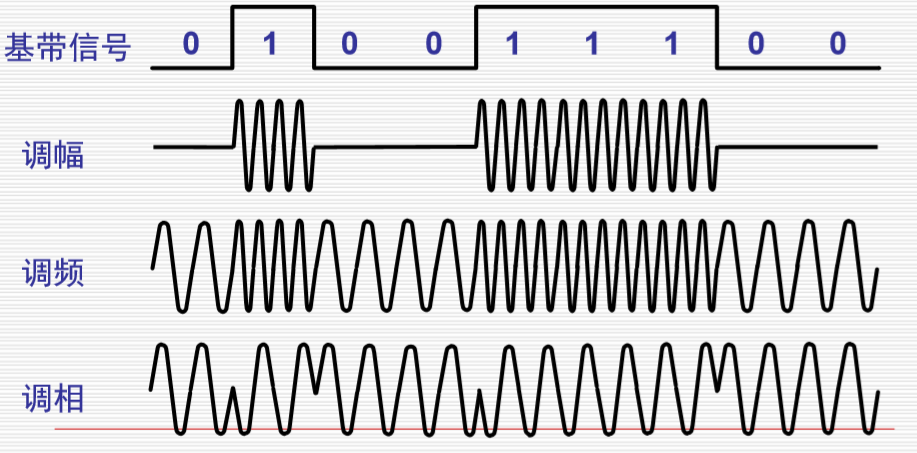

1. 三种不同调制方式

## 5.10. 将数字数据转换到数字信号：线路编码
1. 线路编码是指将二进制数据转换成可以在物理通信链路上传输的形式，例如电线上的电脉冲、光纤上的光脉冲或空间中的电磁波 
2. 在基带传输时数据离散传输，线路编码是有必要的
3. 线路编码作用:在发送和接收双方进行协同操作，避免混淆理解，提高传输效率

## 5.11. 数字通信技术:编码方式的分类
1. 单极性编码:一个正极或者负极
2. 极化编码
    + NRZ(Non-Return to Zero，不归零制码)
    + RZ(Return to Zero，归零制码)
    + 双相位编码
        + 曼彻斯特码
        + 差分曼彻斯特码
3. 双极性编码
    + 传号交替反转码(AMI)
    + 双极性8连0替换码(B8ZS)
    + 3阶高密度双极性码(HDB3)

### 5.11.1. 单极性编码

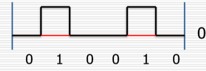

1. 原理：用0电平表示“0”，正电平表示“1”
2. 缺点：
    + 难以分辨一位的结束和另一位的开始
    + 发送方和接收方必须有时钟同步
    + 若信号中“0”或“1”连续出现，信号直流分量将累加，单极性编码的直流分量问题严重
    + 不好知道时钟同步，连续多个0的问题，会有电流大量累积。
3. 结论：容易产生传播错误

### 5.11.2. 极化编码：不归零制码(NRZ: Non-Return to Zero)

1. 不归零电平编码，原理：用负电平表示“0”，正电平表示“1” （或相反），一定的中和。
2. 缺点：
    + 难以分辨一位的结束和另一位的开始
    + 发送方和接收方必须有时钟同步
    + 尽管不会如单极性编码严重，但若信号中“0” 或“1”连续出现，信号直流分量仍将累加
3. 不归零反相编码
    + 原理：信号电平的一次**翻转**代表比特1，无电平变化代表0
    + 不归零反相编码优于不归零电平编码：由于每次遇到“1”（或“0”）都要发生跃迁，因此 可以根据电平跃迁进行有限的同步
    + 不太容易产生电荷的基类，同步还是存在问题的。

### 5.11.3. 极化编码：归零制码（RZ: Return to Zero） 
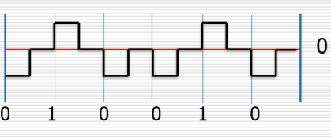

1. 原理：用负电平表示“0”，正电平表示“1”（或 相反），比特中位跳变到零电平，从而提供同步
2. 优点：信号本身带有同步信息，经济性好，且不易出错
3. 缺点：需要采用3个不同电平，两次信号变化来编码1比特，因此增加了占用的带宽

### 5.11.4. 极化编码：曼彻斯特码（Manchester）
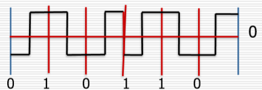

1. 原理：每一位中间都有一个跳变，从低跳到高表示“0”，从高跳到低表示“1”
    + 请思考：“00” “01”曼彻斯特编码下应怎样表示？
    + 优点：克服了NRZ码的不足。每位中间的跳变既可作为数据，又可作为时钟，能够自同步；同时只采用两 个电平，跳变减少，比RZ码效率更高
2. 对于归零编码的改进，使用了两个电位表示2个信息
3. 编码效率为50%，有一半是没有使用的。

### 5.11.5. 极化编码：差分曼彻斯特码（Differential Manchester）
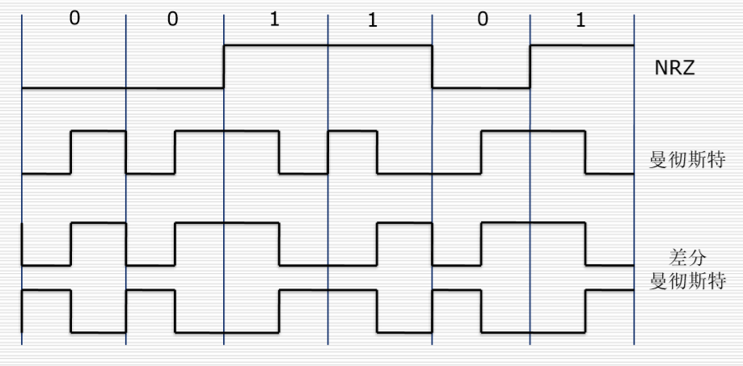

1.  原理：
    + 每一位中间跳变：表示时钟
    + 每一位位前跳变：表示数据：有跳变表示“0”，无跳变表示“1”
2. 优点：时钟、数据分离，便于提取
3. 有变化是1，无变化是0，这时候它要看前一个波形，来生成，如果是0，无变化，如果是1，有变化。

### 5.11.6. 双极性编码：双极性传号交替反转码（AMI）
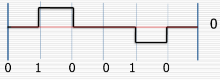

1. 与RZ相同的是: 采用三个电平：正、负与零
2. 与RZ不同的是: 零电平表示“0”，正负电平的跃迁表示 “1”，实现对“1”电平的交替反转。
3. 优点：
    1. 对每次出现的“1”交替反转，使直流分量为0
    2. 尽管连续“0”不能同步，但连续“1”可以同步
4. 这次是1是高点位，下一次就是低电位。

### 5.11.7. 数据通信技术：多路复用

1. 多路复用技术：由于一条传输线路的能力远远超过传输**一个用户**信号所需的能力，为了提高线路利用率，经常让多个信号共用一条物理线路
2. 复用器和分解器，在逻辑上形成。

## 5.12. 多路复用的分类
1. 时分复用 TDM ( Time Division Multiplexing）
2. 频分复用 FDM ( Frequency Division Multiplexing)
3. 波分复用 WDM ( Wavelength Division Multiplexing)
4. 码分复用 CDM (Code Division Multiplexing )

### 5.12.1. 时分复用TDM (Time Division Multiplexing)
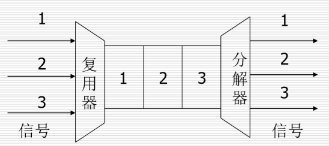

1. 时分复用是将时间划分为一段段等长的时分复用（TDM ）帧， 每个时分复用的用户在每个 TDM 帧中占用固定序号的时隙。
    + 每个间隙发对应的时分复用帧。
    + 复用器在发送时进行处理，分解器则是在接收时进行分解。
2. 每一个用户所占用的时隙是周期性地出现
3. TDM 信号也称为**等时(isochronous)信号**。
4. 时分复用的所有用户在不同的时间占用同样的频带宽度。

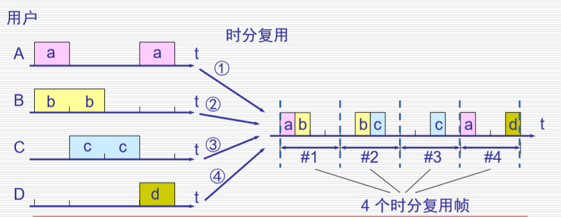

5. 时分复用可能会造成线路资源的浪费：使用时分复用系统传送计算机数据时，由于计算机数据的突发性质，用户对分配到的子信道的利用率一般不高。
6. 帧的长度是一定的，划分时间周期是根据设备进行划分的

### 5.12.2. 统计时分复用 STDM (Statistic TDM) 
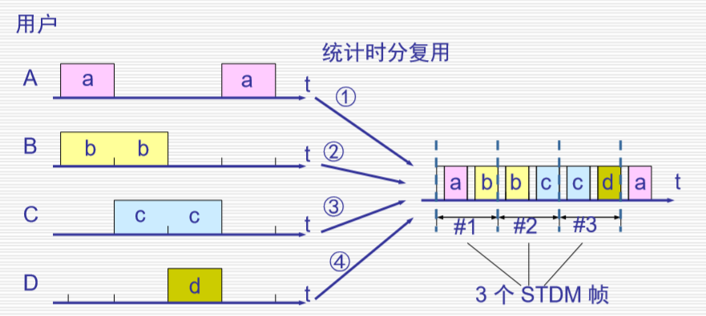

1. 避免大量信道被浪费。
2. 不是固定时间进行分配，而是一旦充足就组织起来，然后被服务成帧，在一个时间周期中组织好了就发送。
3. 问题:不再按照时间来区分用户，所以每个帧都要携带自己的用户信息，会造成浪费
    + 比较主流的使用方案
    + 整体效果好于时分复用
4. 帧是按照时间段来发送，但是是谁先来发送谁的

### 5.12.3. 频分复用 FDM (Frequency Division Multiplexing) 
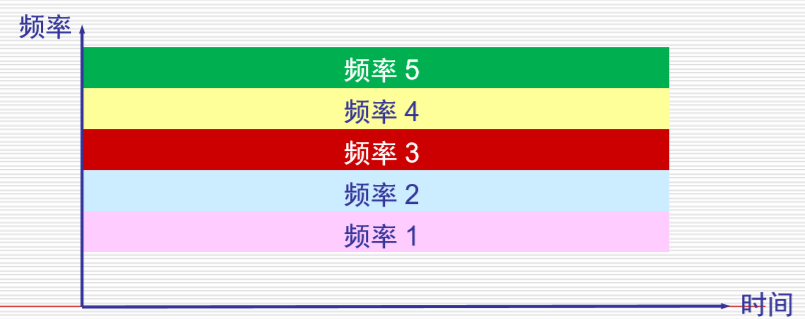

1. 用户在分配到一定的频带后，在通信过程中自始至终都占用这个频带。
2. 所有用户在同样的时间占用不同的带宽资源（请注意，这里的“带宽”是频率带宽）
3. 避免互相干扰:相邻比率之间是有间隔的，大家可以同时使用介质发送自己的信号

### 5.12.4. 波分复用 WDM (Wavelength Division Multiplexing)  
1. 波分复用就是光的频分复用：频率和波长是成倒数关系的。

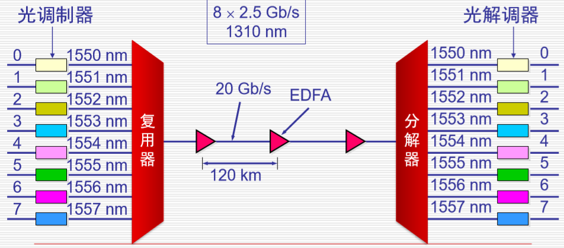

### 5.12.5. 码分复用 CDM (Code Division Multiplexing)  
1. 常用的名词是**码分多址** CDMA(Code Division Multiple Access)
    + 在3G手机时被使用，大家采用相同频率，但是对于数据编码进行变换。(1编译成为n个bits，0编译取1的编译码的反码)
    + 要求不同基站的1的编码是相互正交的，基站2产生的01序列编码不能对基站1的序列编码产生影响。
    + 多个基站使用互相正交的编码，互相不影响，进行复用
2. 各用户使用经过特殊挑选的不同码型，因此彼此
不会造成干扰。
3. 这种系统发送的信号有很强的**抗干扰能力**，其频
谱类似于白噪声，不易被敌人发现。
1. 比如: 基站1：11110000表示1,00001111表示0，将一个字节变成8个字节发送，进行扩充，编码内容不同
2. 频分复用也是使用一个线路

# 6. 其他注释
1. 时间域就是一个时间周期片段
2. 手机的基带更加宽泛一些。