lecture10-WANS
---

<!-- TOC -->

- [1. 广域网技术和设备](#1-广域网技术和设备)
  - [1.1. WAN Services 广域网服务](#11-wan-services-广域网服务)
  - [1.2. 公司的发展](#12-公司的发展)
  - [1.3. 广域网物理结构](#13-广域网物理结构)
  - [1.4. 广域网虚拟电路](#14-广域网虚拟电路)
    - [1.4.1. 广域网虚拟电路的三个阶段(phases)](#141-广域网虚拟电路的三个阶段phases)
    - [1.4.2. 广域网虚拟电路的用途和特点](#142-广域网虚拟电路的用途和特点)
    - [1.4.3. 广域网永久虚拟电路](#143-广域网永久虚拟电路)
  - [1.5. 链接类型和带宽](#15-链接类型和带宽)
  - [1.6. 交换电路连接](#16-交换电路连接)
  - [1.7. 网络连接](#17-网络连接)
  - [1.8. 广域网设备](#18-广域网设备)
    - [1.8.1. Modems 调制解调器](#181-modems-调制解调器)
- [2. 广域网和OSI模型](#2-广域网和osi模型)
  - [2.1. 广域网标准](#21-广域网标准)
  - [2.2. WAN 物理层](#22-wan-物理层)
  - [2.3. WAN 数据链路层](#23-wan-数据链路层)
  - [2.4. 数据链路层的帧封装](#24-数据链路层的帧封装)
- [3. 广域网访问方法](#3-广域网访问方法)
  - [3.1. PPP/HDLC PPP重要考试考](#31-ppphdlc-ppp重要考试考)
    - [3.1.1. 串行线框字段](#311-串行线框字段)
    - [3.1.2. PPP and HDLC](#312-ppp-and-hdlc)
  - [3.2. PPP 点对点协议](#32-ppp-点对点协议)
    - [3.2.1. PPP 组件](#321-ppp-组件)
    - [3.2.2. PPP帧格式](#322-ppp帧格式)
    - [3.2.3. PPP会话建立/终止](#323-ppp会话建立终止)
      - [3.2.3.1. 阶段1：链接建立](#3231-阶段1链接建立)
      - [3.2.3.2. 阶段2：链路质量确定](#3232-阶段2链路质量确定)
      - [3.2.3.3. 阶段3：网络层协议配置](#3233-阶段3网络层协议配置)
      - [3.2.3.4. 阶段4：链接终止](#3234-阶段4链接终止)
    - [3.2.4. PAP 安全认证协议:PPP中一个可选择方法](#324-pap-安全认证协议ppp中一个可选择方法)
      - [3.2.4.1. 远程路由器的配置(Client)](#3241-远程路由器的配置client)
      - [3.2.4.2. 服务提供商路由器的配置(Server)](#3242-服务提供商路由器的配置server)
    - [3.2.5. CHAP(Challenge Handshake Authentication Protocol)](#325-chapchallenge-handshake-authentication-protocol)
      - [3.2.5.1. CHAP: Challenging 挑战](#3251-chap-challenging-挑战)
      - [3.2.5.2. CHAP: Acknowledgement 告知](#3252-chap-acknowledgement-告知)
      - [3.2.5.3. CHAP: Verifying Acknowledgement 验证确认](#3253-chap-verifying-acknowledgement-验证确认)
    - [3.2.6. CHAP的实现](#326-chap的实现)
  - [3.3. 综合数字服务网络(ISDN, Integrated Services Digital Networks)](#33-综合数字服务网络isdn-integrated-services-digital-networks)
    - [3.3.1. BRI(Basic Rate Interface) and PRI(Primary Rate Interface)](#331-bribasic-rate-interface-and-priprimary-rate-interface)
    - [3.3.2. 标准](#332-标准)
  - [3.4. 非对称数字用户线路(ADSL,Asymmetric Digital Subscriber Line)](#34-非对称数字用户线路adslasymmetric-digital-subscriber-line)
    - [3.4.1. xDSL技术](#341-xdsl技术)
    - [3.4.2. xDSL 的几种类型](#342-xdsl-的几种类型)
    - [3.4.3. ADSL 的极限传输距离](#343-adsl-的极限传输距离)
    - [3.4.4. ADSL 的特点](#344-adsl-的特点)
      - [3.4.4.1. DMT 技术](#3441-dmt-技术)
    - [3.4.5. DMT 技术的频谱分布](#345-dmt-技术的频谱分布)
    - [3.4.6. ADSL的数据率](#346-adsl的数据率)
    - [3.4.7. 第二代 ADSL](#347-第二代-adsl)
  - [3.5. SONET](#35-sonet)
    - [3.5.1. 同步光纤网SONET和同步数字系列SDH](#351-同步光纤网sonet和同步数字系列sdh)
    - [3.5.2. 同步光纤网 SONET](#352-同步光纤网-sonet)
    - [3.5.3. 同步数字系列 SDH](#353-同步数字系列-sdh)
    - [3.5.4. SONET 的 OC 级/STS 级与 SDH 的 STM 级的对应关系](#354-sonet-的-oc-级sts-级与-sdh-的-stm-级的对应关系)
    - [3.5.5. SONET 的体系结构](#355-sonet-的体系结构)
    - [3.5.6. 同步光纤网 SONET](#356-同步光纤网-sonet)
    - [3.5.7. SONET 标准的四个光接口层](#357-sonet-标准的四个光接口层)
  - [3.6. HFC(Hybrid Fiber Coax)](#36-hfchybrid-fiber-coax)
    - [3.6.1. 光纤同轴混合网 HFC (Hybrid Fiber Coax)](#361-光纤同轴混合网-hfc-hybrid-fiber-coax)
    - [3.6.2. HFC 的主要特点](#362-hfc-的主要特点)
    - [3.6.3. 用户接口盒UIB (User Interface Box)](#363-用户接口盒uib-user-interface-box)
    - [3.6.4. 电缆调制解调器(Cable Modem)](#364-电缆调制解调器cable-modem)
    - [3.6.5. HFC 网的最大优点](#365-hfc-网的最大优点)
    - [3.6.6. FTTx 技术](#366-fttx-技术)
- [4. 考试要求](#4-考试要求)

<!-- /TOC -->

# 1. 广域网技术和设备

## 1.1. WAN Services 广域网服务
1. 定义:WAN是通过WAN服务提供商连接LAN的通信网络。
2. 一般不是一个单位来做，而是由运营商完成，而在运营商之间沟通好相互的接入问题。
3. WAN在OSI的前三层运行，但**主要集中在物理和数据链路层**。
4. 广域网和局域网相比相对低效
5. 广域网位于物理层和数据链路层

## 1.2. 公司的发展
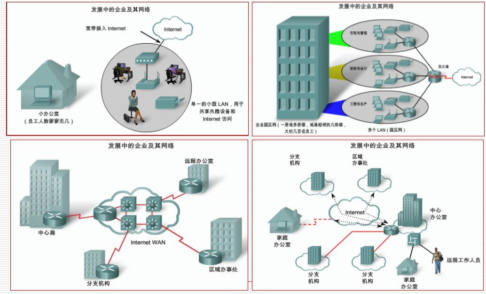

- 广域网的最小单位是公司
- 随着公司逐渐的发展才发展(公司的发展是需求)
- 最上角:公司刚成立的时候，小的局域网就可以搞定了(几台主机)，对外提供服务少，局域网协同办公。
- 右上角:随着公司的发展，一家发展到几十家，需要将不同的项目分开，每一个项目都有对应的项目经理和开发人员，多个局域网组成一个AS(自治系统)。还是一个出口，ASP要求高，VLAN隔离和防火墙
- 左下角:再次发展，有多个分支机构，区域办事处等，物理上隔离的很远，这时候建立一个数据中心(存放全部业务数据)，保证团队可以在任何位置访问，公司向ISP请求租用一个广域网链路。
- 右下角:最后进一步发展，覆盖全球:公司规模足够大，考虑成本，需要部署站点到站点之间的VPN，保证效率更高。

## 1.3. 广域网物理结构
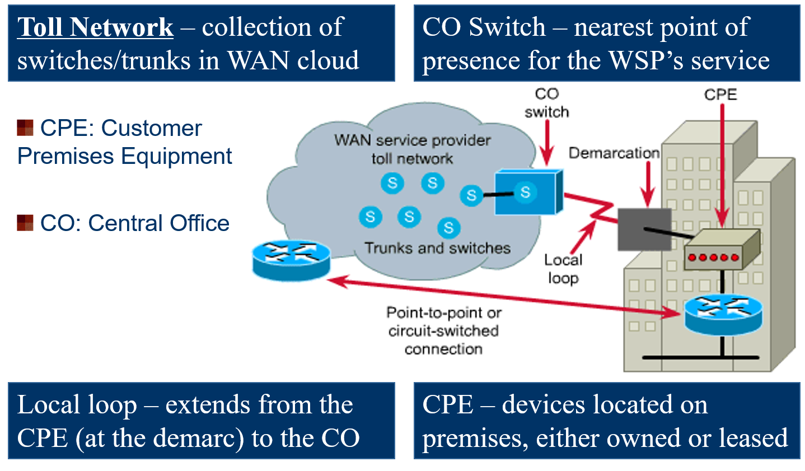

- 涉及到具体一个公司的接入
- 通过NetWork远程接入，通过WSP提供的CO Swtich来连接到中心局
- CPE:位于公司本地的设备(主要是接入设备)，可以向ISP购买或者租用，购买上网服务(猫)
- CPE和远端通过Local loop连接(最后一公里)，ISP做解决方案。
- Demarcation(分界点)：分界点一侧是ISP做解决方案，而另一侧是本地进行管理。

## 1.4. 广域网虚拟电路
1. 交换虚拟电路(SVC，Switched Virtual Circuits)是到目的地的WAN路径，可根据需要建立(established)和终止(terminated)。

### 1.4.1. 广域网虚拟电路的三个阶段(phases)
1. 电路建立–创建虚拟电路(逻辑确定)
2. 数据传输–发送和接收用户数据(含有虚电路号等)
3. 电路中断–拆除虚拟电路

### 1.4.2. 广域网虚拟电路的用途和特点
1. 电话服务和ATM使用SVC
2. 增加带宽使用但降低成本(多人同时使用)

### 1.4.3. 广域网永久虚拟电路
>永久(Permanent)虚拟电路(PVC)是采用以下一种模式的永久建立的电路：数据传输
1. X.25和帧中继使用PVC
2. 减少带宽使用，但增加成本
3. 用户和运营商进行硬件(专用线路)
4. 对应于数据传输量持久且大

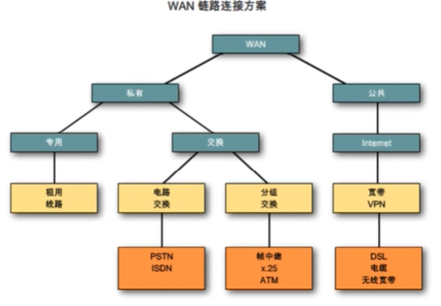

- 分组交换是稳定性和使用时间不确定
- VPN:加密信息，避免被截获

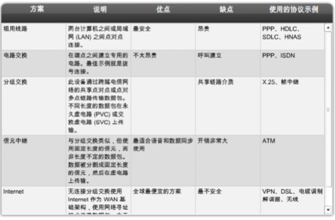

## 1.5. 链接类型和带宽
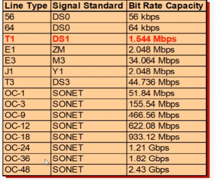

1. T：美国标准
2. E：欧洲标准


## 1.6. 交换电路连接


> PSTN：需要调节器，慢


> ISDN:多个B信道和P信道组合

- BRI:2个B和一个D
- PRI:T1:23B + D 和 E1:30B + D

## 1.7. 网络连接


- 直接连接到运营商，DSL接入(以太网转换成DSL信号)


- 永久在线连接，用于有线电视传输等，共享电缆开关等

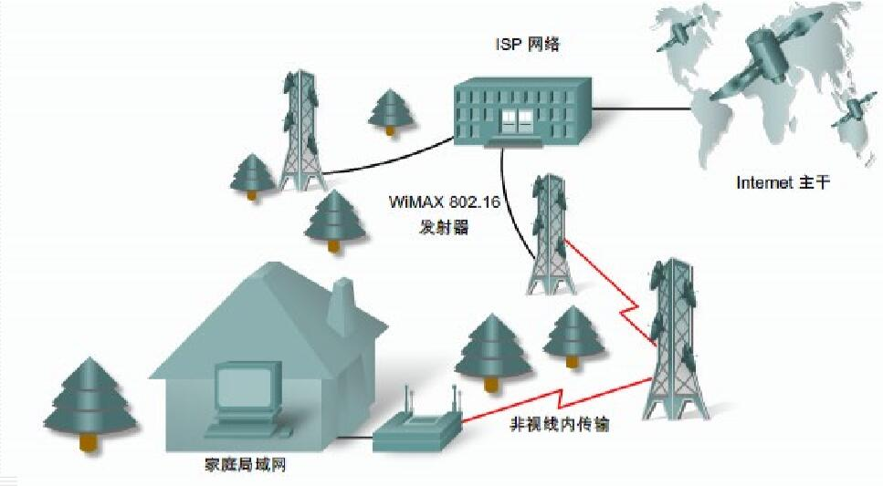

- 无线
  - 地面无线信道
  - 无线信道

## 1.8. 广域网设备
1. 为了连接到专线(leased line)，客户必须具备以下条件：
   1. 访问服务提供商的电路
   2. 可用的适当路由器端口
   3. CSU/DSU，调制解调器，ISDN终端适配器等。

### 1.8.1. Modems 调制解调器
1. 通道服务单元 CSU,Channel Service Units/数字服务单元 DSU,Digital Service Units
2. 与语音级(voice-grade)连接接口，以便将模拟信号转换为数字信号。


1. CPE(左边的用户网关路由器，作为终端数据单元(DTE)):往往是路由器
2. DCE:将信号转换成运营商可以接受的信号发送给远端。

# 2. 广域网和OSI模型

## 2.1. 广域网标准
1. WAN标准主要描述OSI模型的哪些层？**物理层和数据链路层**，物理层提供电器标准，数据链路层封装到远程的部分:帧标准

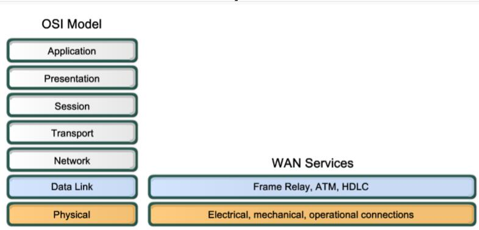

2. 连接通信服务提供商提供的服务所需的电气、机械、操作和功能特性。
3. 描述DTE和DCE之间的接口

## 2.2. WAN 物理层
1. 描述如何为WAN服务提供电气，机械，操作和功能连接的协议。
2. 这些服务通常是从WAN服务提供商，备用运营商，电话后和电报(PTT)机构获得的。
3. 描述数据终端设备(DTE, Data Terminal Equipment)和数据电路终端设备(DCE. Data Circuit-terminating Equipment)之间的接口。
4. 通常，DCE是服务提供商，而DTE是连接的设备。
5. 在此模型中，通过调制解调器或 CSU / DSU 提供给DTE的服务。


>一般以用户路由器作为DTE，运营商提供的Modem做信号转换，作为DCE

1. 指定DTE和DCE之间此接口的几种物理层标准是...
   1. EIA/TIA-232 (RS-232):计算机常用
   2. EIA/TIA-449
   3. V.24
   4. V.35
   5. X.21
   6. G.703
   7. EIA-530
2. 一般都是串线接口

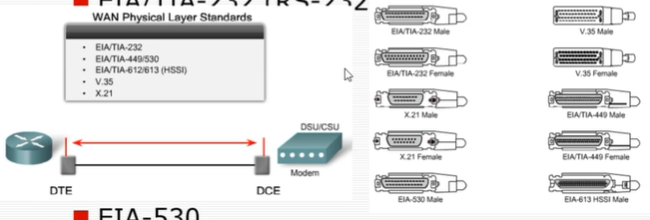


## 2.3. WAN 数据链路层
1. WAN数据链路协议描述了如何在单个数据链路上的系统之间承载帧。
2. 它们包括旨在在专用(dedicated)点对点，多点和多址交换服务上运行的协议。
3. WAN 标准由许多公认的机构定义和管理，包括以下机构：ITU-T，ISO，IETF和EIA
4. 不是那么可靠，帧结构和以太网帧不同，协议是点对点，点对多点，多链路交换机切换
5. 为了确保正确:需要为每一个串口指定一个方式组成帧

## 2.4. 数据链路层的帧封装
1. WAN数据链路层定义了如何封装数据以传输到远程站点
   1. **点对点协议(PPP,Point-to-Point Protocol)**:由IETF开发。PPP包含用于识别网络层协议的协议字段(包含一个协议单元，指定网络协议)
   2. **高级数据链路控制(HDLC, High-Level Data Link Control)**:ISO标准，不同供应商之间不兼容的HDLC，因为每个供应商都选择了实现方式。HDLC支持点对点/多点配置(抽象规范和约束，各个厂商不同)
   3. **帧中继(Frame Relay)**：使用简化的封装，对高质量的数字设备不进行纠错。(比较高速)
   4. **ISDN**：通过现有电话线传输语音和数据的一组数字服务。
   5. **平衡的链路访问程序(LAPB, Link Access Procedure, Balanced)**：用于在X.25堆栈的第2层封装数据包的数据包交换网络。 提供点对点的可靠性和流量控制。


# 3. 广域网访问方法

## 3.1. PPP/HDLC PPP重要考试考
1. 点对点的标准
2. 以思科厂商为标准
3. 工作在串行链路上的
4. 如果都是同一个厂商的可以用HDLC，不然使用PPP

### 3.1.1. 串行线框字段
1. 两种最常见的点对点WAN封装是HDLC(High-level Data Protocol)和PPP(Point to Poing Protocol)
2. 所有串行线封装共享一个通用的帧格式，该格式具有以下字段


>封装协议的选择取决于WAN技术和通信设备。

### 3.1.2. PPP and HDLC
1. PPP是一种标准的**串行线路**封装方法
   1. 由IETF(The Internet Engineering Task)开发;取代SLIP(Serial Line Internet Protocol)
   2. 包含标识网络层协议的字段
   3. PPP可以在建立连接期间检查链接质量
   4. 通过密码认证协议(PAP)和质询握手认证协议(CHAP)提供认证。
2. HDLC是Cisco串行线的默认封装
   1. 没有窗口或流量控制
   2. 框架中插入了专有类型(所有权)代码，这意味着HDLC帧不能与其他供应商的设备互操作。
   3. 当专用线路连接的两端是运行Cisco IOS的路由器时使用
   4. 不做出窗口控制和流控制

## 3.2. PPP 点对点协议
1. 串行链路上使用最广泛的第2层协议
2. 从SLIP开发，
   1. 仅支持IP协议
   2. 不支持动态IP分配
   3. 不支持身份验证
   4. 不支持压缩
   5. 不支持错误检测
3. PPP提供以下功能
   1. 网络协议多路复用
   2. 动态分配IP地址
   3. 验证：PAP，CHAP
   4. 压缩
   5. 错误检测

### 3.2.1. PPP 组件
1. 使用HDLC(ISO HDLC，而非Cisco HDLC)作为封装第3层数据报的基础
2. 实现LCP(链接控制协议)以：
   1. 建立连接
   2. 连接配置选项
   3. 链接质量测试
3. 实施NCP(网络控制协议，Network Control Protocol)以选择和配置第3层协议。

### 3.2.2. PPP帧格式


>数字的单位是字节
1. Flag: 01111110 标记：帧的开头或结尾，01111110，一位可能会连续接受到多个帧
2. Address：11111111，广播地址
3. Control：00000011，用户数据作为无序帧传输
4. Protocol: 数据字段中的协议类型
5. Data: 数据报，最大默认值为1500字节
6. FCS: 2或者4字节

### 3.2.3. PPP会话建立/终止
1. 为了通过点对点链路建立通信，PPP经历四个不同的阶段：
   1. 步骤一:链接建立和配置协商(negotiation)(LCP)。
   2. 步骤二:链接质量测试。
   3. 步骤三:网络层协议配置(NCP)。
   4. 步骤四:链接终止。
2. 图示如下

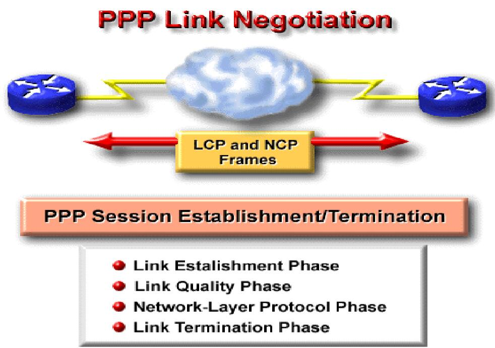

#### 3.2.3.1. 阶段1：链接建立
1. 建立链接是交换任何网络层数据报之前的第一阶段
   1. 每个PPP设备发送LCP来打开连接
   2. LCP数据包包含一个配置选项字段，该字段允许设备协商选项的使用，例如**压缩和身份验证协议**等。
   3. 如果LCP数据包中未包含配置选项，则采用该配置选项的**默认值**。
   4. 当已发送和接收配置**确认**帧时，此阶段完成。
2. 在完成这个步骤前不会传输具体数据帧的。

#### 3.2.3.2. 阶段2：链路质量确定
1. 发送和接收LCP数据包以测量链路上的错误率(如果已配置)
2. 身份验证(如果使用)在网络层协议配置阶段开始之前进行。(可选)
3. LCP可以延迟网络层协议信息的传输，直到完成此阶段。
4. 在这之前不能传输网络帧。

#### 3.2.3.3. 阶段3：网络层协议配置
1. 在此阶段，PPP设备发送NCP数据包以选择和配置一个或多个网络层协议(例如IP)。
2. 配置了每个选定的网络层协议后，可以通过链接发送来自每个网络层协议的数据报。

#### 3.2.3.4. 阶段4：链接终止
1. LCP可以随时终止链接：
   1. 应用户要求；(一方请求终止)
   2. 链接质量
   3. 超时
2. 当LCP关闭链接时，它将通知网络层协议，以便它们可以采取适当的措施。

### 3.2.4. PAP 安全认证协议:PPP中一个可选择方法
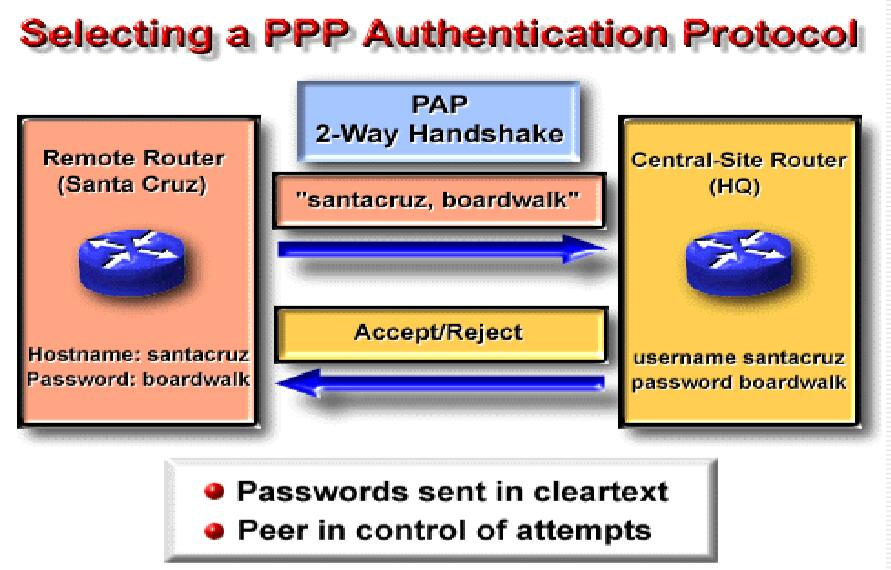

>PAP由一方向另一方发起请求，另一方选择是否接受，双方具有相同的用户名和密码,发起方可以多次尝试

1. 链接的发起方(Calling Side)输入身份验证信息，以帮助确保用户具有网络管理员的许可来进行连接。
2. 远程节点使用双向握手PAP建立其身份。
3. 远程节点**重复**发送用户名/密码对，直到确认身份验证或连接终止
4. 密码以明文形式通过链接发送。
5. 在建立连接阶段之后，仅对远程节点进行一次身份验证。

#### 3.2.4.1. 远程路由器的配置(Client)

```
1 Router(config)#hostname RTA
2 RTA(config)#int s0
3 RTA(config)#ip address 192.168.2.1 255.255.255.0
4 RTA(config)#encapsulation ppp
5 RTA(config)#ppp pap sent-username RTA password ciscoA
6 RTA(config)#no shut 
```

#### 3.2.4.2. 服务提供商路由器的配置(Server)
1. 认证和RouteA相同的用户名密码

```
1 Router(config)#hostname RTB
2 RTB(config)#username RTA password CiscoA
3 RTB(config)#int s0
4 RTB(config)#ip address 192.168.2.2 255.255.255.0
5 RTB(config)#clock rate 56000
6 RTB(config)#encapsulation ppp
7 RTB(config)#ppp authentication pap
8 RTB(config)#no shut 
```

### 3.2.5. CHAP(Challenge Handshake Authentication Protocol)
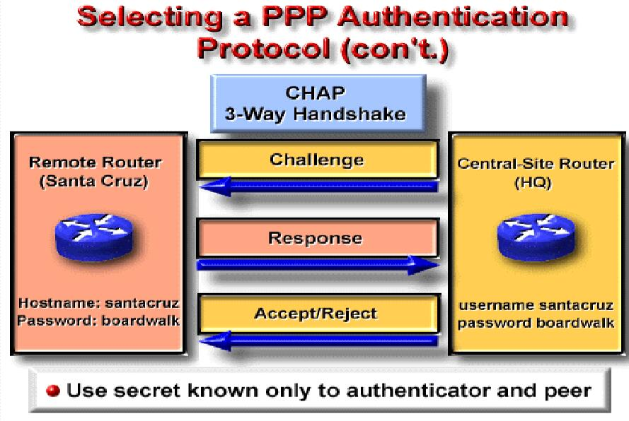

>避免明文发送,三阶段握手,发起方是HQ，找一个时间来Challenge，然后由用户进行response，之后决定是否接受。密码密文发送比较安全，而且更加合理的设计。

1. 被叫方使用三向握手CHAP协议定期验证主叫方。
2. CHAP不允许呼叫者在没有Challenge(随机数)的情况下尝试进行身份验证。(Challenge->随机数)
3. 主机(称为参与者)将质询消息发送到远程节点。
4. 远程节点以一个值(加密的值，包括：接收到的质询，其用户名和密码)进行响应:value是challenge和密钥生成的
5. 主机根据自己的价值检查响应
   1. 如果值匹配，则确认身份验证
   2. 否则，连接终止

#### 3.2.5.1. CHAP: Challenging 挑战
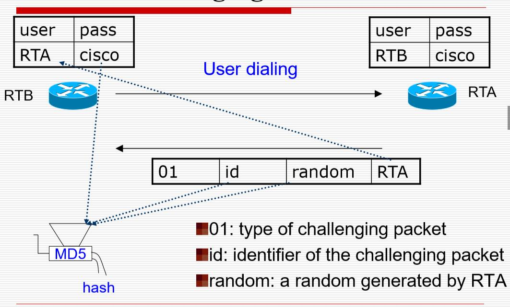

- RTB请求连接RTA
- 他们都存储一个用户名密码，但是用户名不同，密码相同
- RTB发送一个连接请求
- RTA找一个时间来发起挑战
- 挑战中内容:
  - 编号
  - id是第几次挑战
  - random:生成的随机数
  - RTA:谁发起的挑战

#### 3.2.5.2. CHAP: Acknowledgement 告知
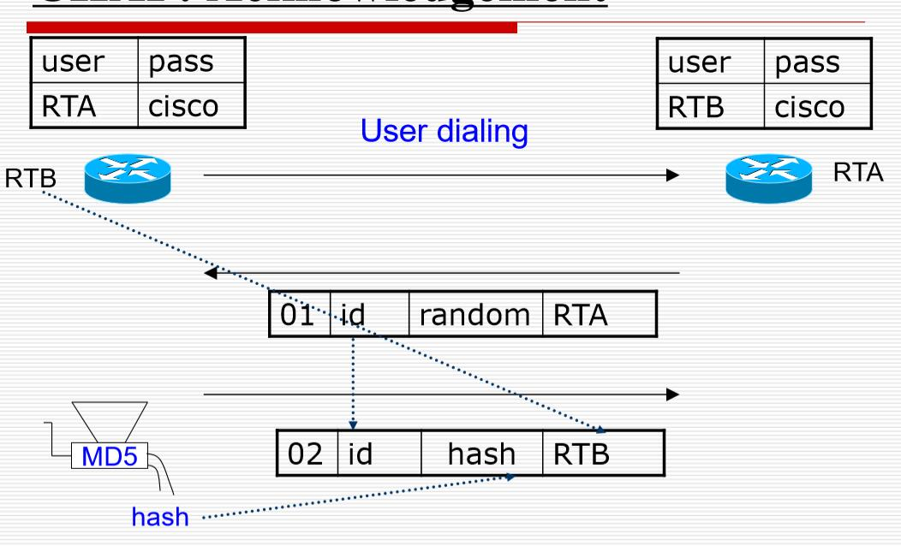

- RTB进行应答，
- RTB操作:pass + random 使用 MD5 算法 -> 哈希值

#### 3.2.5.3. CHAP: Verifying Acknowledgement 验证确认


- RTA收到RTB的回复，然后比较是否相同

### 3.2.6. CHAP的实现
1. 远端路由器的配置

```
1 Router(config)#hostname RTA
2 RTA(config)#username RTB password CiscoA
3 RTA(config)#int s0
4 RTA(config)#ip address 192.168.2.1 255.255.255.0
5 RTA(config)#encapsulation ppp
6 RTA(config)#no shut 
```

1. 服务提供者服务器的配置

```
1 Configuration of service provider router
2 Router(config)#hostname RTB
3 RTB(config)#username RTA password CiscoA
4 RTB(config)#int s0
5 RTB(config)#ip address 192.168.2.2 255.255.255.0
6 RTB(config)#clock rate 56000
7 RTB(config)#encapsulation ppp
8 RTB(config)#ppp authentication chap
9 RTB(config)#no shut 
```

## 3.3. 综合数字服务网络(ISDN, Integrated Services Digital Networks)
1. 集成服务数字网络允许通过现有电话线传输数字信号:提供远程站点的连接
2. ISDN具有以下优点：
   1. 可以携带语音，视频和数据
   2. 使用带外D(或Delta)信道比调制解调器(有时<1s)更快的呼叫建立
   3. 使用B(或屏障)通道以64kps提供更快的数据传输

### 3.3.1. BRI(Basic Rate Interface) and PRI(Primary Rate Interface)
1. ISDN服务有两种：
   1. BRI(基本速率接口, Basic Rate Interface),用户虚拟电路数据传，HDLC,PPP
   2. PRI(主速率接口,Primary Rate Interface)，发送控制信息，LAPD
2. ISDN BRI服务提供两个B通道和一个D通道。
3. ISDN BRI将144kbps(2B + D = 144kps)线路的总带宽传送到三个单独的通道中。
4. BRI B信道服务以64 kbps的速率运行，旨在承载用户数据和语音流量。
5. 第三个通道，D通道，是一个16 kbps信令通道，用于承载指令，这些指令告诉电话网络如何处理每个B通道。
6. BRI和DRI都是基于电话信道的

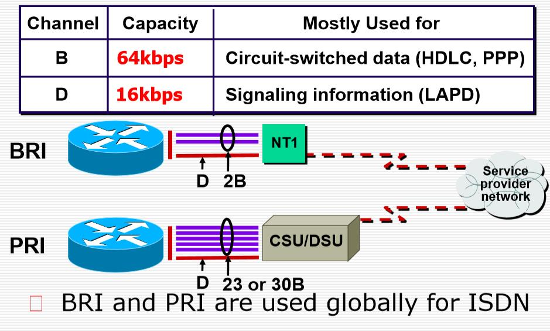

- B信道传递HDLC和PPP数据帧
- D信道传递LAPD数据帧

### 3.3.2. 标准
1. ISDN利用一套(suit)ITU-T标准套件，涵盖OSI参考模型的物理，数据链路和网络层。
2. 有几种封装选择。两种最常见的封装是PPP和HDLC。
3. ISDN默认为HDLC。但是，PPP更为健壮，因为它为兼容链接和协议配置的身份验证和协商提供了出色的机制。
4. ISDN接口仅允许使用一种封装类型,不允许混合使用封装。

## 3.4. 非对称数字用户线路(ADSL,Asymmetric Digital Subscriber Line)
1. DSL:Digital Subscribe Line

### 3.4.1. xDSL技术
1. xDSL 技术就是用数字技术对现有的模拟电话用户线进行改造，使它能够承载宽带业务
2. 虽然标准模拟电话信号的频带限制在 300~3400kHz 范围内，但用户线本身实际可通过的信号频率仍超过 1 MHz
3. xDSL 技术把 0~4 kHz 低端频谱留给传统电话使用，而把原来没有被利用的高端频谱留给用户上网使用
4. DSL:数字用户线(Digital Subscriber Line)
5. DSL的前缀 x 表示在数字用户线上实现的不同宽带方案

### 3.4.2. xDSL 的几种类型
1. ADSL (Asymmetric Digital Subscriber Line)：非对称数字用户线
2. HDSL (High speed DSL)：高速数字用户线
3. SDSL (Single-line DSL)：1 对线的数字用户线
4. VDSL (Very high speed DSL)：甚高速数字用户线
5. IDSL:ISDN 用户线
6. RADSL (Rate-Adaptive DSL)：速率自适应 DSL，是 ADSL 的一个子集，可自动调节线路速率

### 3.4.3. ADSL 的极限传输距离
1. ADSL 的极限传输距离与**数据率**以及**用户线的线径**都有很大的关系(用户线越细，信号传输时的衰减就越大)，而所能得到的最高数据传输速率与实际的用户线上的信噪比密切相关。
2. 例如，0.5 毫米线径的用户线，传输速率为 1.5 ~ 2.0 Mb/s 时可传送 5.5 公里，但当传输速率提高到 6.1 Mb/s 时，传输距离就缩短为 3.7 公里。
3. 如果把用户线的线径减小到0.4毫米，那么在6.1 Mb/s的传输速率下就只能传送2.7公里
4. **线越细，衰减速度越快。**

### 3.4.4. ADSL 的特点
1. 上行和下行带宽不对称:上行指从用户到 ISP，而下行指从 ISP 到用户
2. ADSL 在用户线(铜线)的两端各安装一个 ADSL 调制解调器。
3. 我国目前采用的方案是离散多音调 DMT (Discrete Multi-Tone)调制技术。这里的"多音调"就是"多载波" 或"多子信道"的意思。

#### 3.4.4.1. DMT 技术
1. DMT 调制技术采用频分复用的方法，把 40 kHz 以上一直到 1.1 MHz 的高端频谱划分为许多的子信道，其中 25 个子信道用于上行信道，而 249 个子信道用于下行信道。
2. 每个子信道占据 4 kHz 带宽(严格讲是 4.3125 kHz)，并使用不同的载波(即不同的音调)进行数字调制。这种做法相当于在一对用户线上使用许多小的调制解调器并行地传送数据。
3. 用户需求大量的操作是下载，从4KHz开始是为了避免人声部分。

### 3.4.5. DMT 技术的频谱分布


>示意图，每一个信道之间是有隔离的，也是每一个信道之间并不是紧挨的

### 3.4.6. ADSL的数据率
1. 由于用户线的具体条件往往相差很大(距离、线径、受到相邻用户线的干扰程度等都不同)，因此ADSL采用自适应调制技术使用户线能够传送尽可能高的数据率。
2. 当ADSL启动时，用户线两端的ADSL调制解调器就测试可用的频率、各子信道受到的干扰情况，以及在每一个频率上测试信号的传输质量。
3. ADSL不能保证固定的数据率。对于质量很差的用户线甚至无法开通ADSL。
4. 通常下行数据率在 32 kb/s 到 6.4 Mb/s 之间，而上行数据率在 32 kb/s 到 640 kb/s 之间。


>示意图:PS接入是电话分离器，一部分给电话，一部分给数据。

1. 数字用户线接入复用器 DSLAM (DSL Access Multiplexer)
2. 接入端接单元ATU (Access Termination Unit)
3. ATU-C(C 代表端局 Central Office
4. ATU-R(R 代表远端 Remote)
5. 电话分离器 PS (POTS Splitter)

### 3.4.7. 第二代 ADSL
1. ADSL2(G.992.3 和 G.992.4) ADSL2+(G.992.5)
2. **通过提高调制效率得到了更高的数据率**。例如，ADSL2 要求至少应支持下行 8 Mb/s、上行 800 kb/s的速率。而 ADSL2+ 则将频谱范围从 1.1 MHz 扩展至2.2 MHz，下行速率可达 16 Mb/s(最大传输速率可达25 Mb/s)，而上行速率可达 800 kb/s。
3. 采用了**无缝速率自适应技术 SRA** (Seamless Rate Adaptation)，可在运营中不中断通信和不产生误码的情况下，自适应地调整数据率。
4. 改善了线路质量评测和故障定位功能，这对提高网络的运行维护水平具有非常重要的意义。

## 3.5. SONET

### 3.5.1. 同步光纤网SONET和同步数字系列SDH 
1. 旧的数字传输系统存在着许多缺点。其中最主要的是以下两个方面：
2. 速率标准不统一：**如果不对高次群的数字传输速率进行标准化，国际范围的高速数据传输就很难实现。**
3. 不是同步传输： **在过去相当长的时间，为了节约经费，各国的数字网主要是采用准同步方式。**

### 3.5.2. 同步光纤网 SONET
1. 同步光纤网 SONET (Synchronous Optical Network) 的各级时钟都来自一个非常精确的主时钟(铯原子钟，精度优于10<sup>-11</sup>秒)
2. 第 1 级同步传送信号 STS-1 (Synchronous Transport Signal)的传输速率是 51.84 Mb/s。
3. 光信号则称为第 1 级光载波 OC-1，OC 表示 Optical Carrier。

### 3.5.3. 同步数字系列 SDH
1. ITU-T 以美国标准 SONET 为基础，制订出国际标准同步数字系列 SDH (Synchronous Digital Hierarchy)。
2. 一般可认为 SDH 与 SONET 是同义词。
3. SDH 的基本速率为 155.52 Mb/s，称为第 1 级同步传递模块 (Synchronous Transfer Module)，即 STM-1，相当于 SONET 体系中的 OC-3 速率。

### 3.5.4. SONET 的 OC 级/STS 级与 SDH 的 STM 级的对应关系
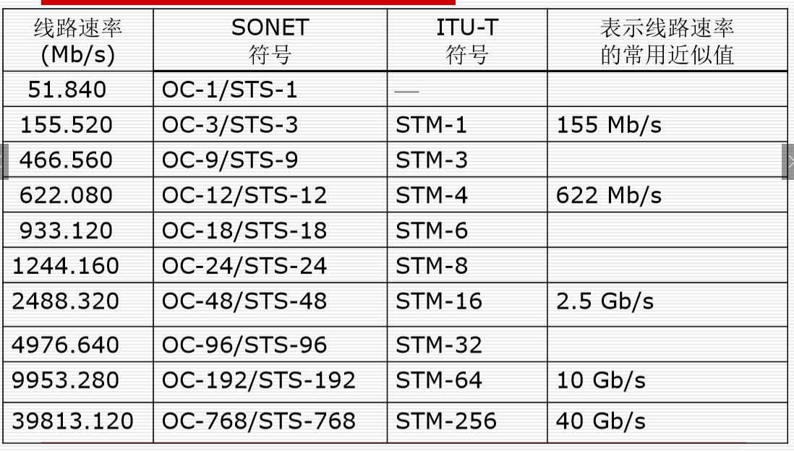

### 3.5.5. SONET 的体系结构
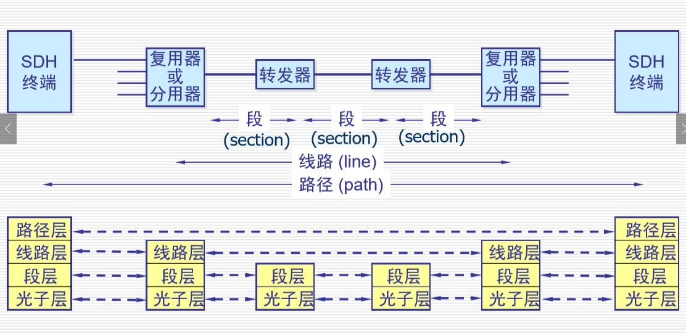

- SDH也是光传输
- 路径很长，分为一段一段的线路。
- 线路中复用器和复用器之间分成段，使用转发器

### 3.5.6. 同步光纤网 SONET
1. SONET 第 1 级同步传送信号 STS-1  ( Synchronous Transport Signal) 的传输速率为 51.84 Mb/s，第 3 级同步传送信号 STS-3 传输速率是 STS-1 的3倍，为155.52 Mb/s， …，等等，依此类推。


2. STS帧为时分复用幀，8000帧/秒，每帧125 μS
3. 其对应的光信号则称为第 1 级光载波 OC-1 (OC表示 Optical Carrier)，第 3 级光载波 OC-3， …，等

### 3.5.7. SONET 标准的四个光接口层
1. 光子层(Photonic Layer)：处理跨越光缆的比特传送。
2. 段层(Section Layer)：在光缆上传送 STS-N 帧。
3. 线路层(Line Layer)：负责路径层的同步和复用
4. 路径层(Path Layer)：处理路径端接设备 PTE (Path Terminating Element)之间的业务的传输。

## 3.6. HFC(Hybrid Fiber Coax)
1. 主要链路用光纤，到户用同轴电缆

### 3.6.1. 光纤同轴混合网 HFC (Hybrid Fiber Coax)
1. HFC 网是在目前覆盖面很广的有线电视网 CATV 的基础上开发的一种居民宽带接入网。
2. HFC 网除可传送 CATV 外，还提供电话、数据和 其他宽带交互型业务。
3. 现有的 CATV 网是树形拓扑结构的同轴电缆网络， 它采用模拟技术的频分复用对电视节目进行单向传 输。而 HFC 网则需要对 CATV 网进行改造，

### 3.6.2. HFC 的主要特点
1. HFC网的**主干线**路采用光纤
2. HFC 网将原 CATV 网中的同轴电缆主干部分改换为光纤，并使用模拟光纤技术。
3. 在模拟光纤中采用光的振幅调制 AM，这比使用数字 光纤更为经济。
4. 模拟光纤从头端连接到**光纤结点(fiber node)**，即光分配结点 ODN (Optical Distribution Node)。在光纤结点光信号被转换为电信号。在光纤结点以下就是同轴电缆。(光信号转换成点信号)

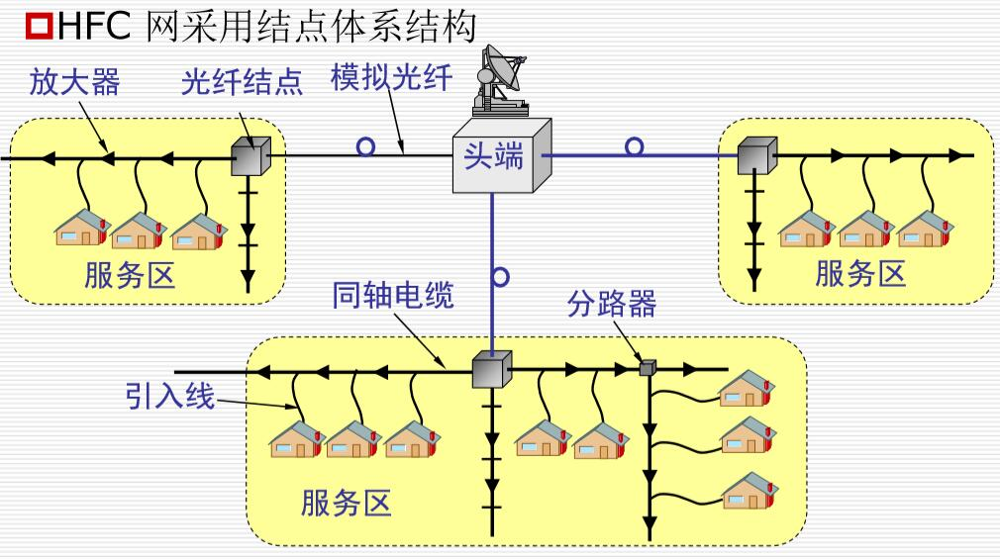

>到小区前是光传输，之后是电传输

1. 具有比 CATV 网更宽的频谱，且具有双向传输功能


### 3.6.3. 用户接口盒UIB (User Interface Box)
1. 每个家庭要安装一个用户接口盒
2. 用户接口盒要提供三种连接，即：
   1. 使用同轴电缆连接到机顶盒(set-top box)，然后再连接到用户的电视机。
   2. 使用双绞线连接到用户的电话机。
   3. 使用电缆调制解调器连接到用户的计算机。

### 3.6.4. 电缆调制解调器(Cable Modem) 
1. 电缆调制解调器是为 HFC 网而使用的调制解调器。
2. 电缆调制解调器最大的特点就是**传输速率高**。其下行速率一般在 3∼10  Mb/s之间，最高可达 30 Mb/s，而上行速率一般为 0.2∼2 Mb/s，最高可达 10 Mb/s。
3. 电缆调制解调器比在普通电话线上使用的调制解调器要复杂得多，并且不是成对使用，而是只安装在**用户端**。(远端是光，不是电)

### 3.6.5. HFC 网的最大优点
1. 具有很宽的频带，并且能够利用已经有相当大的覆盖面的有线电视网。
2. 要将现有的 450 MHz 单向传输的有线电视网络改造为 750 MHz 双向传输的 HFC 网(还要将所有的用户服务区互连起来而不是一个个 HFC 网的孤岛)， 也需要相当的资金和时间。
3. 在电信政策方面也有一些需要协调解决的问题。
4. 电信也在跨界到视频

### 3.6.6. FTTx 技术
1. FTTx(光纤到……)也是一种实现宽带居民接入网的方案。这里字母 x 可代表不同意思。
   1. 光纤到家 FTTH (Fiber To The Home)：光纤一直铺设到用户家庭可能是居民接入网最后的解决方法。
   2. 光纤到大楼 FTTB (Fiber To The Building)：光纤进入大楼后就转换为电信号，然后用电缆或双绞线分配到各用户。
   3. 光纤到路边 FTTC (Fiber To The Curb)：从路边到各用户可使用星形结构双绞线作为传输媒体。
   
# 4. 考试要求
1. 名词解释
2. ADSL意义、实现和B和D信道的带宽使用等